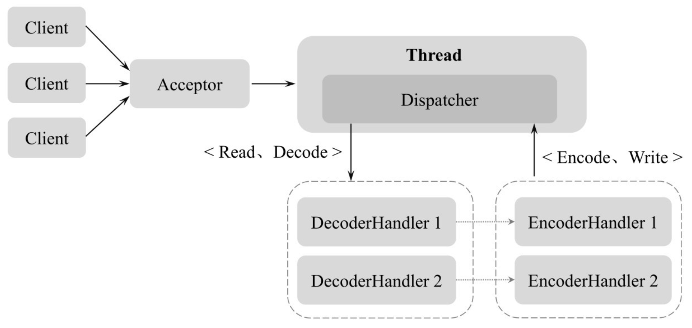
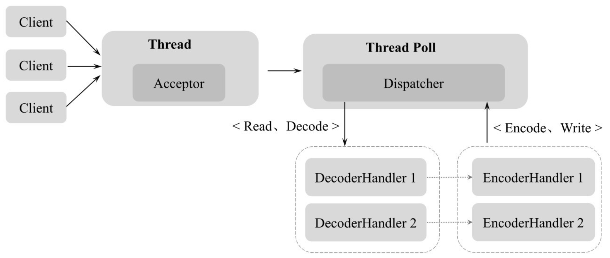
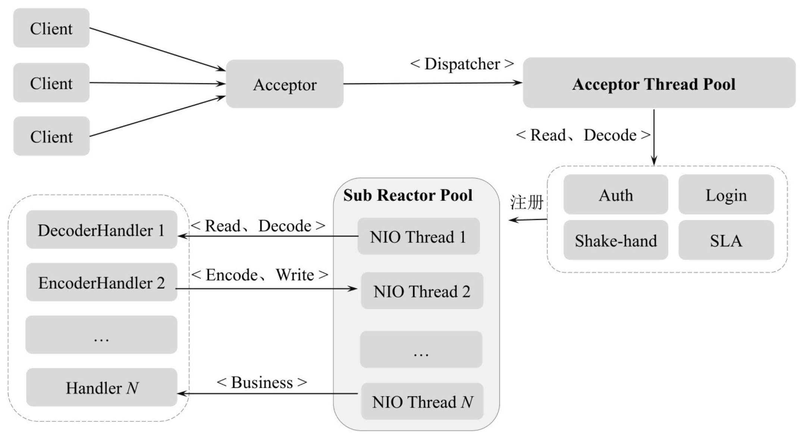

[TOC]

Netty 是一个**高性能**、**异步事件驱动的 NIO 框架**，基于 Java NIO 提供的 API 实现，提供了对 TCP（Transmission Control Protocol）、UDP（User Datagram Protocol） 和文件传输的支持。

## 1.Reactor 线程模型

Reactor 是一种**并发**处理客户端请求响应的**事件驱动模型**。

- 服务端在接收到客户端请求后采用**多路复用**策略
- 通过一个**非阻塞**的线程来**异步**接收所有的客户端请求
- 并将这些请求转发到相关的工作线程组上进行处理

### 1.Java NIO

3个核心概念：

- Selector（选择器）
  - 用于监听多个 Channel 上是否有 I/O 事件，并对检查到的 I/O 事件进行相应的响应和处理；
    - 一个线程可以实现多个 Channel 的管理；
    - 不必为每个连接都创建一个线程，避免线程资源的浪费和多线程之间的上下文切换导致的开销；

- Channel（通道）
  - 传统的 I/O **基于数据流**进行 I/O 读写操作；
    - Stream 是单向的，如 InputStream、OutputStream；
  - Java NIO **基于 Channel 和 Buffer** 进行 I/O 读写操作，数据总是从 Channel 读取到 Buffer，或从 Buffer 写入 Channel；
    - Channel 是双向的，既可以用来读，也可用来写；
  - 主要实现：
    - FileChannel，对应文件读写；
    - DatagramChannel，对应UDP 的广播事件；
    - SocketChannel，对应 Socket 客户端的 TCP 的 I/O 读写操作；
    - ServerSocketChannel，对应 Socket 服务端的 TCP 的 I/O 读写操作；
- Buffer（缓冲区）
  - 一个容器，内部通过一个连续字节数组存储 I/O 上的数据；
  - 常用实现类：
    - ByteBuffer
    - IntBuffer
    - CharBuffer
    - LongBuffer
    - DoubleBuffer
    - FloatBuffer
    - ShortBuffer

### 2.Reactor 单线程模型

Reactor 单线程模型，指所有的客户端 I/O 操作请求都在同一个线程上完成。

各模块组成及职责：

- Client：NIO 客户端，向服务端发起 TCP 连接，并发送数据；
- Accpetor：NIO 服务端，通过 Acceptor 接收客户端的 TCP 连接；
- Dispatcher：接收客户端的数据，并将数据以 ByteBuffer 的形式发送到对应的编解码器；
- DecoderHandler：解码器，读取客户端的数据，并进行数据解码、数据处理和消息应答；
- EncoderHandler：编码器，将给客户端发送的数据（消息请求或消息应答）进行统一的编码处理，并写入通道；

Reactor 模式使用异步非阻塞 I/O，Reactor 单线程模型将所有 I/O 操作都集中在一个线程中处理，具体处理流程：

1. Acceptor 接收客户端的 TCP 连接请求消息；
2. 链路建立成功后，通过 Dispatcher 将接收到的消息写入 ByteBuffer，并派发到对应的 DecoderHandler 上进行消息解码和处理；
3. 消息处理完成后，调用对应的 EncoderHander，将请求响应进行消息的编码和下发；

### 3.Reactor 多线程模型

与单线程模型最大区别：Reactor 多线程模型用于接收客户端请求的 Acceptor 由一个线程来负责，用于处理客户端消息的 Dispatcher 由一个线程池负责，基于线程池的调度和线程异步执行的能力，能够接收和处理更多的请求。

### 4.Reactor 主从多线程模型

Reactor 主从多线程模型中，Acceptor 线程池（Acceptor Thread Pool）只用于客户端的鉴权、登录、握手和安全认证，一旦链路建立成功后，将新创建的 SocketChannel 注册到子 I/O 线程池（Sub Reactor Pool）的某个 I/O 线程上，由它负责具体的 SocketChannel 的读写和编解码工作。

这样，将客户端连接的建立和消息的响应都以异步线程的方式来实现，大大提高了系统的吞吐量。

