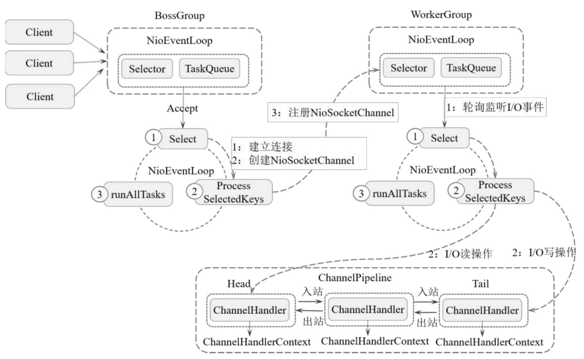

[TOC]


## 1.Netty简介

Netty 是一个**高性能**的**异步事件驱动**的**网络应用程序框架**，主要用于客户端和服务端网络应用程序的快速搭建和开发。

基于 Netty 可以非常快速、方便的构建一个**高性能**的 TCP 或 UDP 的**网络应用**，不仅极大地**简化了网络编程的复杂度**，还**提高**了网络应用程序的**性能和稳定性**。

支持多种网络通信协议：

- TCP
- UDP
- FTP
- HTTP
- SMTP ...


## 2.Netty的架构设计

官网架构图：


整体架构分为三部分：Transport Services（传输服务层）、Protocol Support（传输协议层）和 Core（核心层）。

### 1.Transport Services 传输服务层

**主要定义了数据的传输和通信方式**，包括以下3部分：

- Socket & DataGram（Socket 协议和数据包）
  - 基于 Socket 的协议有 TCP、UDP 等；
    - TCP 基于报文应答机制实现，主要用于可靠数据的传输
      - 如移动设备状态信息的传输；
    - UDP 发出的数据不需要对方应答，主要用于数据安全性要求不是很高，但是对数据传输吞吐量要求较高的场景
      - 如实时视频流传输

- HTTP Tunnel（HTTP 隧道）
  - 定义了 HTTP 的传输方式
- In-VM Pipe（本地传输管道）
  - 定义了本地数据的传输方式

### 2.Protocol Support 传输协议层

**主要定义了数据传输过程中的服务类型、数据安全、数据压缩等**，具体包括以下7部分：

1. HTTP & WebSocket（HTTP 和 WebSocket 服务）
   - 定义了客户端和服务端的数据通信方式
   - HTTP 服务基于 HTTP 实现，主要用于客户端主动向服务端发起数据包请求。
   - WebSocket 主要用于服务端基于消息推送的机制，实时将数据包推送到客户端。
2. SSL & StartTLS（SSL 和 StartTLS 协议）
   - SSL（Secure Socket Layer | 安全套接层）主要用于传输层与应用层之间的直接网络数据的加密，是为网络通信提供安全及数据完整性的一种安全协议。
     - SSL 包含记录层（Record Layer）和传输层（Transport Layer）。
     - 基于层协议确定传输层数据的封装格式。
     - 传输层安全协议使用 X.509 认证，之后利用非对称加密演算来对通信方进行身份认证，最后交换对称秘钥作为此次会话的秘钥。
     - 基于该会话秘钥来实现通信双方数据的加密，保证两个应用程序间通信的保密性和可靠性，是客户端与服务端的应用程序之间的通信不被攻击者窃听。
   - Start SSL 是一种明文通信协议的扩展，能够让明文的通信连线直接成为加密连线（使用 SSL 或 TLS 加密），而不需要使用另一个特别的端口来进行加密通信，属于机会性加密。
     - Smart SSL 是一个与应用层无关的协议，可以搭配许多应用层协议一同使用。
3. zlib/gzip Compression（zlib/gzip 压缩算法）
   - 定义了消息传递过程中数据的压缩和解压缩算法，主要用于提高批量数据传输过程中网络的吞吐量。
   - zlib 是一种数据压缩格式，其使用抽象化的 DEFLATE 算法实现，应用十分广泛，Linux 内核中使用 zlib 以实现网络协议的压缩、文件系统的压缩。
   - OpenSSH、OpenSSL 以 zlib 达到最优化的加密网络传输。
   - gzip 的基础也是 DEFLATE 算法，gzip 也是一种数据压缩格式。
4. Large File Transfer（大文件传输）
   - 定义了大文件传输过程中数据的拆包和分发策略。
5. Google ProtoBuf（Google ProtoBuf 格式）
   - Google 发布的一款开源的数据传输格式和序列化框架。
   - 是一种语言中立、平台无关、可扩展的序列化数据的格式，可用于通信协议、数据存储等。
   - 在序列化数据方面，提供了高效的序列化实现。
   - 很适合用于数据存储或 RPC 数据交换格式。
6. RTSP（实时流传输协议）
   - Real Time Streaming Protocol
   - 是一种网络应用协议，专为娱乐和通信系统使用，以控制流媒体服务器。
   - 该协议用于创建和控制终端之间的媒体会话。
   - 媒体服务器的客户端发布 VCR 命令，如，播放、录制和暂停，以便实时控制从服务器到客户端（视频点播）或从客户端到服务器（语音录音）的流媒体。
7. Legacy Text & Binary Protocols（传统 TXT 和二进制数据）
   1. 提供了传统文本数据格式和二进制数据格式的传输支持。


### 3.Core 核心层

核心层封装了 Netty 框架的核心服务和 API，具体包括以下：

- Extensible Event Model（可扩展事件模型）
  - 为 Netty 灵活的时间通信提供了基础；
- Universal Communication API（通用通信协议 API）
  - 为上层提供了统一的 API 访问入口，提高了 Netty 框架的易用性；
- Zero-Copy-Capable Rich Byte Buffer（零拷贝字节缓冲区）
  - 为数据的快速读取和协议提供了保障；


## 3.Netty的核心组件

Netty 的核心组件主要包括：

- BootStrap
  - 用于客户端服务的启动引导
- ServerBootStrap
  - 用于服务端服务的启动引导
- NioEventLoop
  - 基于线程队列的方式执行事件操作，具体要执行的事件包括：
    - 连接注册
    - 端口绑定
    - I/O 数据读写等
  - 每个 NioEventLoop 线程都负责多个 Channel 的事件处理。
- NioEventLoopGroup
  - NioEventLoop 生命周期的管理
- Future/ChannelFuture
  - 用于异步通信的实现
  - 基于异步通信方式
    - 在 I/O 操作触发后注册一个监听事件；
    - 在 I/O 操作（数据读写完成或失败）完成后自动触发监听事件并完成后续操作；
- Channel
  - Channel 是 Netty 中的网络通信组件，用于执行具体的 I/O 操作。
  - Netty 中所有的数据通信都基于 Channel 读取或者将数据写入对应的 Channel。
  - Channel 主要功能包括：
    - 网络连接的建立
    - 连接状态的管理（网络连接的打开和关闭）
    - 网络连接参数的配置（每次接收数据的大小）
    - 基于异步 NIO 的网络数据操作（数据读取、数据写出）等
- Selector
  - Selector 用于多路复用中的 Channel 的管理。
  - 在 Netty 中，一个 Selector 可以管理多个 Channel，在 Channel 连接建立后将连接注册到 Selector，Selector 在内部监听每个 Channel 上的 I/O 事件的变化，当 Channel 有网络 I/O 事件发生时通知 ChannelHandler 执行具体的 I/O 操作。
- ChannelHandlerContext
  - Channel 上下文信息的管理，每个 ChannelHandler 都对应一个 ChannelHandlerContext。
- ChannelHandler
  - I/O 事件的拦截和处理，其中：
    - ChannelInboundHandler 用于处理数据接收的 I/O 操作；
    - ChannelOutboundHandler 用于处理数据发送的 I/O 操作；
- ChannelPipeline
  - 基于拦截器设计模式实现的时间拦截处理和转发。
  - Netty 中每个 Channel 都对应一个 ChannelPipeline，在 ChannelPipeline 中维护了一个由 ChannelHandlerContext 组成的双向链表，每个 ChannelHandlerContext 都对应一个 ChannelHandler，以完成具体 Channel 事件的 拦截和处理。其中：
    - 数据入站由 Head 向 Tail 依次传递和处理；
    - 数据出站从 Tail 向 Head 依次传递和处理。

## 4.Netty的原理

Netty 的运行核心包含两个 NioEventLoopGroup 工作组：

- 一个是 BossGroup，用于接收客户端连接、接收客户端数据和进行数据转发；
- 另一个是 WorkerGroup，用于具体 I/O 事件的触发和数据处理；

### 4.1 Netty Server 的初始化步骤

Netty Sever的初始化过程如下。

1. 初始化BossGroup和WorkerGroup。
2. 基于ServerBootstrap配置EventLoopGroup，包括连接参数设置、Channel类型设置、编解码Handler设置等。
3. 绑定端口和服务启动。

具体代码实现如下：

```java
public static void main(String[] args) {
    // 1 创建 BossGroup和WorkerGroup
    NioEventLoopGroup bossGroup = new NioEventLoopGroup();
    NioEventLoopGroup workerGroup = new NioEventLoopGroup();
    // 2 配置 NioEventLoopGroup
    final ServerBootstrap serverBootstrap = new ServerBootstrap();
    serverBootstrap
            .group(bossGroup, workerGroup)
            //设置Channel的类型为NIO
            .channel(NioSctpServerChannel.class)
            //设置BACKLOG的大小为1024
            .option(ChannelOption.SO_BACKLOG, 1024)
            //启用心跳检测机制
            .childOption(ChannelOption.SO_KEEPALIVE, true)
            //设置数据包无延迟
            .childOption(ChannelOption.TCP_NODELAY, true)
            .childHandler(new ChannelInitializer<NioSocketChannel>() {
                @Override
                protected void initChannel(NioSocketChannel nioSocketChannel) throws Exception {
                    //配置解码器为MessageDecoder类
                    nioSocketChannel.pipeline().addLast("decoder", new MessageDecoder());
                    //配置编码器为MessageEncoder类
                    nioSocketChannel.pipeline().addLast("encoder", new MessageEncoder());
                }
            });
    // 3 绑定端口和服务启动
    int port = 9000;
    serverBootstrap
            .bind(port)
            .addListener(future -> {
                if (future.isSuccess()) {
                    System.out.println("server start up on port:" + port);
                } else {
                    System.out.println("server start up failed");
                }
            });
}
```


### 4.2BossGroup 的职责

BossGroup 为一个事件循环组，其中包含多个事件循环（NioEventLoop），每个 NioEventLoop 都包含一个 Selector 和一个 TaskQueue（事件循环线程）。

每个 Boss NioEventLoop 循环执行以下3个步骤：

1. 轮询监听 accept 事件。
2. 接收和处理 accept 事件，包括和客户端建立连接并生成 NioSocketChannel，将 NioSocketChannel 注册到某个 Worker NioEventLoop 的 Selector 上。
3. 处理 runAllTasks 的任务。


### 4.3WorkerGroup 的职责

WorkerGroup 为一个事件循环组，其中包含多个事件循环（NioEventLoop），每个 Worker NioEventLoop 循环都执行以下3个步骤：

1. 轮询监听 NioSocketChannel 上的 I/O 事件（I/O 读写事件）。
2. 当 NioSocketChannel 有 I/O 事件触发时，执行具体的 I/O 操作。
3. 处理任务队列中的任务。




