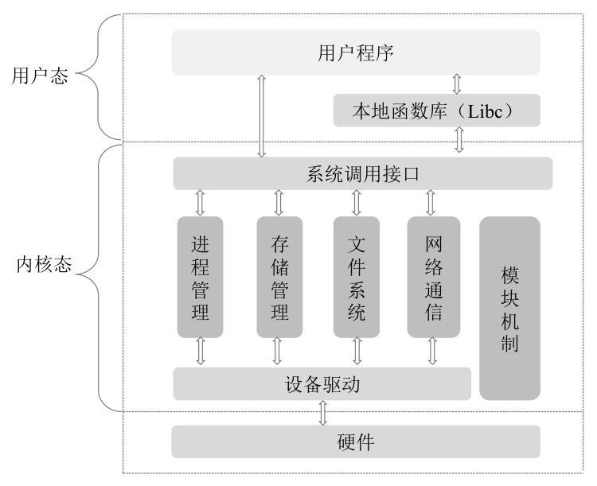

[TOC]

# Netty 特性

Netty 之所以能在高并发的分布式网络环境下实现对数据的快速处理和分发，得益于其优秀的架构设计。

Netty 架构设计的主要特性有多路复用模型、数据零拷贝、内存重用机制、无锁化设计和高性能的序列化框架。

## 1.I/O 多路复用模型

在高并发的 I/O 编程模型中，一个服务端往往要同时处理成千上万个客户端请求。

传统的 I/O 模型，会为每个 Socket 链路都建立一个线程专门处理该链路上数据的接收和发送。方案特点：

- 当客户端较少时，服务端的数据处理速度很快；
- 但当客户端数量较多时，服务端会出现没有足够的线程资源为每个 Socket 链路分配一个线程的情况；服务端会出现大量的线程资源争抢和调度，性能急剧下降。
- 不适合高并发场景。

I/O 多路复用模型，将 I/O 的处理分为 Selector 和 Channel。

- Selector 负责多个 Channel 的监控和管理；
- Channel 负责真正的 I/O 读写操作；
- 当 Selector 监控到 Channel 上有数据发生变化时，通知对应的 Channel，Channel 接收到对应的通知后，处理对应的数据即可。
- 这样，一个 Selector 可以同时处理多个客户端的请求。

I/O 多路复用模型，与传统的多线程 I/O 模型相比，I/O 多路复用模型的最大优势是**系统开销小**，系统不需要为每个客户端连接都建立一个新的线程，也不需要维护这些线程的运行，减少了系统的维护工作量，节省了系统资源。

Netty 通过**在 NioEventLoop**（事件轮询机制）内**封装 Selector 来实现 I/O 的多路复用**，在一个 NioEventLoop 上服务端可以同时并发处理成千上万个客户端请求，同时由于 Netty 的I/O **读写操作**都是基于 **ByteBuffer 异步非阻塞**的，因此大大提高了 I/O 线程的运行效率，**避免由于频繁 I/O 阻塞导致的线程挂起和系统资源的浪费**。

## 2.数据零拷贝

Linux 为了实现操作系统程序和应用程序的**资源隔离**，将系统分为**内核态**和**用户态**。

操作系统的程序运行在内核态，具体包括：

- 进程管理
- 存储管理
- 文件系统
- 网络通信
- 模块机制

应用程序运行在用户态，并且不能访问内核态的地址空间。

如果应用程序需要访问系统内核态的资源，则需要通过系统调用接口或本地函数库来完成。具体流程：

- 用户程序调用系统应用接口或本地函数库；
- 系统应用接口或本地函数库，调用系统进程获取资源，并将其分配到对应的用户程序；
- 用户程序资源在使用完成后，通过系统调用接口或本地函数库释放资源；

传统的 Socket 服务基于 JVM 堆内存进行 Socket 读写，即，申请内存资源时，需要通过 JVM 向操作系统申请堆内存，然后 JVM 将堆内存复制一份到直接内存中，基于直接内存进行 Socket 读写。这样就存在频繁的 JVM 内存数据和 Socket 线程内存数据来回复制的问题，影响系统性能。

Netty 的数据接收和发送均采用**堆外直接内存进行 Socket 读写**，堆外直接内存可以直接操作系统内存，不需要来回地进行字节缓冲区的二次复制，大大提高了系统的性能。

同时，Netty 提供了**组合 Buffer 对象**，基于该对象可以聚合多个 ByteBuffer 对象，使得用户操作多个 Buffer 与操作一个 Buffer 一样方便，避免了传统的通过内存复制的方式将多个小 Buffer 合并为一个大 Buffer 带来的使用不便和性能损耗。

Netty 的文件传输采用 transferTo 方法。transferTo 方法可以直接将文件缓冲区的数据**基于内存映射技术**发送到目标 Channel，避免了通过循环写方式导致的内存复制问题。

## 3.内存重用机制

JVM 对于对象内存的分配和回收耗时很小，但 Netty 数据的接收和发送均采用堆外直接内存缓存的方式实现，而堆外直接内存缓存的分配和回收是一件耗时的操作。

为了尽量重用缓冲区，Netty 提供了**基于内存池的缓冲区重用机制**。

## 4.无锁化设计

对于一般程序来说，多线程会提高系统的并发度，但是线程数并不是越多越好，过多的线程会引起 CPU 的频繁切换而增加系统的负载。

Netty 内部采用串行无锁化设计的思想对 I/O 进行操作，**避免多线程竞争 CPU 和资源锁定**导致的性能下降。

在具体使用时，可以调整 NIO 线程池的线程参数，**同时启动多个串行化的线程并行运行**，这种**局部无锁化的串行多线程设计**，比一个队列结合多个工作线程模型的性能更佳。

Netty 的 NioEventLoop 的设计思路是 Channel 读取消息后，直接调用 ChannelPipeline 的 fireChannelRead(Object msg) 进行消息的处理，如果在运行过程中用户不主动切换线程，Netty 的 NioEventLoop 则一直在该线程上进行消息的处理，这种线程绑定 CPU 持续执行的方式，可以有效减少系统资源的竞争和切换，对于持续高并发的操作来说性能有很大的提升。

## 5.高性能的序列化框架

Netty 默认基于 Google ProtoBuf 实现数据的序列化，通过扩展 Netty 的编解码接口，用户可以实现自定义的序列化框架，如 Thrift 的压缩二进制编解码框架。

使用 ProtoBuf 时需要注意以下几点：

- SO_RCVBUF、SO_SNDBUF 的设置：接收数据的 Buffer 大小、发送数据的 Buffer 大小，通常建议值为 128KB 或者 256 KB。
- SO_TCPNODELAY 的设置：将 SO_TCPNODELAY 设置为 true，表示**开启自动粘包操作**，该操作采用 Nagla 算法将缓冲区内字节较少的包前后相连组成一个大包一起发送，防止大量小包频繁发送造成网络的阻塞，从而提高网络的吞吐量。
- 软中断：在开启软中断后，Netty 会根据数据包的源地址、源端口、目的地址、目的端口计算一个 Hash 值，根据该 Hash 值选择对应的 CPU 执行软中断。即 Netty 将每个链接都与 CPU 绑定，并通过 Hash 值在多个 CPU 上均衡软中断，以提高 CPU 的性能。

