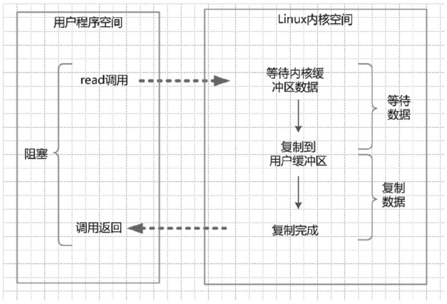
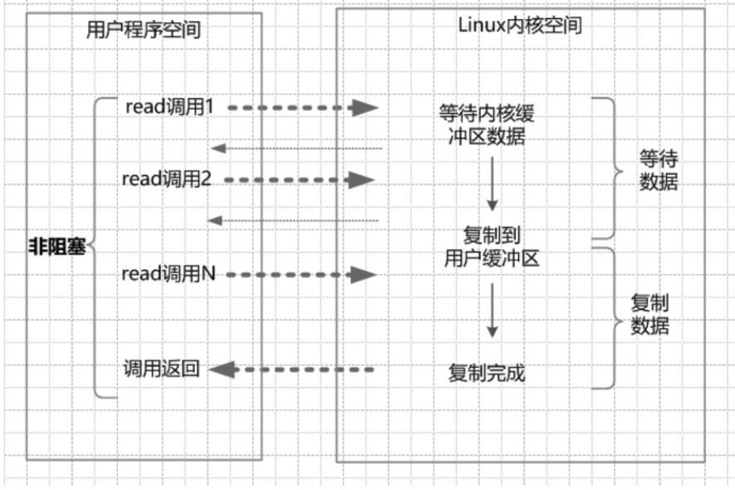
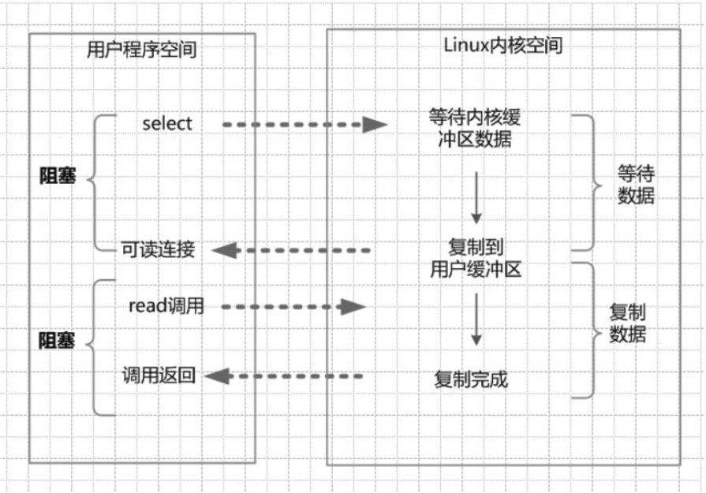
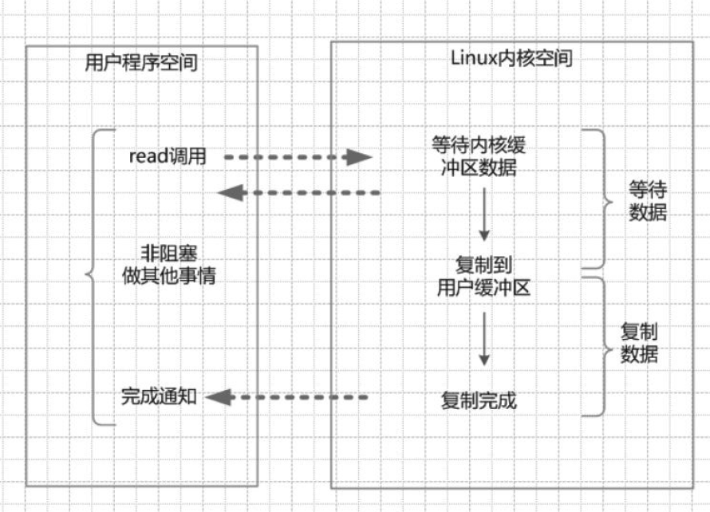

[TOC]

# 2.高并发IO的底层原理

## 2.1 IO 读写的基础原理

上层应用

- 调用操纵系统的 read，是把数据从**内核缓冲区**复制到**进程缓冲区**；

- 调用操作系统的 write，是把数据从**进程缓冲区**复制到**内核缓冲区**；

read & write 系统调用，是底层的读写交换，是由操作系统内核（Kernel）来完成的。


### 2.1.1内核缓冲区与进程缓冲区

缓冲区的目的：为了减少频繁的与设备之间的物理交换。

- 外部设备的直接读写，涉及操作系统的中断。
- 发生系统中断时，需要保存之前的进程数据和状态等信息；
- 而结束中断后，还需要恢复之前进程数据和状态等信息；
- 为了减少这种底层系统的时间、性能损耗，于是出现了内存缓冲区。

Linux 操作系统，只有一个内核缓冲区；而每个用户程序（进程），有自己独立的缓冲区，叫做进程缓冲区。

- 用户程序的 IO 读写程序，在大多数情况下，并没有进行实际的 IO 操作，而是在进程缓冲区和内核缓冲区之间直接进行数据的交换。


### 2.1.2详细典型的系统调用过程

在 Java 服务器端，完成一次 Socket 请求和响应，完整的流程如下：

- 客户端请求：Linux 通过网卡读取客户端的请求数据，将数据读取到内核缓冲区；
- 获取请求数据：Java 服务器通过 read 系统调用，从 Linux 内核缓冲区读取数据，送入 Java 进程缓冲区；
- 服务器端业务处理：Java 服务器在自己的用户控件中处理客户端的请求；
- 服务器端返回数据：Java 服务器完成处理后，构建好的响应数据，使用 write 系统调用，将这些数据从用户缓冲区写入内核缓冲区；
- 发送给客户端：Linux 内核通过网络 IO，将内核缓冲区中的数据写入网卡，网卡通过底层的通信协议，将数据发送给目标客户端；


## 2.2四种主要的 IO 模型

阻塞，指的是，用户空间程序的执行状态。

- 阻塞 IO：需要内核 IO 操作彻底完成后，才返回到用户空间执行用户的操作。
- 非阻塞 IO，指的是用户口空间的程序不需要等待内核 IO 操作彻底完成，可以立即返回用户空间，执行用户的操作。

同步与异步，是用户空间与内核空间的 IO 发起方式。

- 同步 IO，是指用户空间的线程是主动发起 IO 请求的一方，内核空间是被动接收方。

- 异步 IO，是指系统内核是主动发起 IO 请求的一方，用户空间的线程是被动接收方。


### 2.2.1 同步阻塞 IO（Blocking IO）

传统的 IO 模型都是同步阻塞 IO。

在 Java 中，默认创建的 Socket 都是阻塞的。

在阻塞式 IO 模型中，Java 应用程序从 IO 系统调用开始，直到系统调用返回，在这段时间内，Java 进程是阻塞的。返回成功后，应用程序开始处理用户空间的缓冲区数据。



在 Java 中发起一个 Socket 的 read 读操作的系统调用，流程大致如下：

- 从 Java 启动 IO 读的 read 系统调用开始，用户线程进入阻塞状态；
- 当系统内核收到 read 系统调用，开始准备数据。一开始，数据可能还没有到达内核缓冲区（比如还没有收到一个完整的 socket 数据包），这时内核就要等待。
- 内核一直等到完整的数据到达，就会将数据从内核缓冲区复制到用户缓冲区，然后内核返回结果（比如返回复制到用户缓冲区中的字节数）。
- 直到内核返回后，用户线程才会接触阻塞的状态，重新运行起来。

阻塞 IO 特点：在内核进行 IO 执行的两个阶段，用户线程都被阻塞了。

阻塞 IO 优点：

- 应用程序开发非常简单；
- 在阻塞等待数据期间，用户线程挂起，基本不会占用 CPU 资源；

阻塞 IO 缺点：

- 一般情况下，会为每个连接配备一个独立的线程；即一个线程维护一个连接的 IO 操作；
- 并发量小时没什么问题；
- 高并发应用场景下，需要大量的线程来维护大量的网络连接，内存、线程切换开销会非常巨大；

基本上，阻塞 IO 模型在高并发应用场景下是不可用的。


### 2.2.2 同步非阻塞 IO（Non-Blocking IO）

非阻塞 IO，指的是用户口空间的程序不需要等待内核 IO 操作彻底完成，可以立即返回用户空间，执行用户的操作，即处于非阻塞的状态，与此同时，内核会立即返回给用户一个状态值。

非阻塞 IO 要求 socket 被设置为 NONBLOCKING。

强调：这里说的 NIO 模型，并非 Java 的 NIO 库（New IO）。Java 的 NIO 指的是 IO 多路复用模型。

在 NIO 模型中，应用程序一旦开始 IO 系统调用，会出现以下两种情况：

- 在内核缓冲区中没有数据的情况下，系统调用立即返回一个调用失败的信息；
- 在内核缓冲区中有数据的情况下，是阻塞的，直到数据从内核缓冲区复制到用户进程缓冲区。复制完成后，系统调用返回成功，应用程序开始处理用户空间的缓存数据。



发起一个非阻塞 Socket 的 read 读操作的系统调用，流程大致如下：

- 在内核数据没有准备好的阶段，用户线程发起 IO 请求时，立即返回。所以，为了读取到最终的数据，用户线程需要不断地发起 IO 系统调用。
- 内核数据到达后，用户线程发起系统调用，用户线程阻塞。内核开始复制数据，将数据从内核缓冲区复制到用户缓冲区，然后内核返回结果（比如返回复制数据的字节数）。
- 用户线程读到数据后，才会接触阻塞状态，重新运行起来。即，用户进程需要经过多次的尝试，才能保证最终真正读到数据，而后继续执行。

同步非阻塞 IO 特点：

- 应用程序的线程需要不断地进行 IO 系统调用，轮询数据是否已经准备好：
  - 如果没有准备好，就继续轮询；
  - 直到完成 IO 系统调用为止。

同步非阻塞 IO 的优点：

- 每次发起的 IO 系统调用，在内核等待数据过程中可以立即返回，用户线程不阻塞，实时性较好。

同步非阻塞 IO 的缺点：

- 不断地轮询内核，将占用大量 CPU 时间，效率低下。

在高并发场景下，同步非阻塞 IO 也是不可用的。

一般很好直接使用，而是在其他 IO 模型中使用非阻塞 IO 这一特性。


### 2.2.3 IO 多路复用（IO Multiplexing）

经典的 Reactor 反应器设计模式，有时也称为异步阻塞 IO。

Java 中的 Selector 选择器和 Linux 中的 epoll 都是这种模型。


在 IO 多路复用模型中，引入了一种新的系统调用，用来查询 IO 就绪状态。

- 在 Linux 系统中，对应的是 select/epoll 系统调用。
- 通过该系统调用，一个进程可以监控多个文件描述符，一旦某个描述符就绪（一般是内核缓冲区可读/可写），内核能够将就绪的状态返回给应用程序。
- 然后，应用程序根据就绪的状态，进行相应的 IO 系统调用。

发起一个多路复用 IO 的 read 读操作的系统调用，流程如下：

- 注册选择器。将需要 read 操作的目标 socket 网络连接，提前注册到 select/epoll 选择器中。
- 就绪状态的轮询。通过选择器的查询方法，查询注册过的所有 Socket 连接的就绪状态。通过查询的系统调用，内核会返回一个就绪的 Socket 列表。
  - 当用户进程调用了 select 查询方法，那么整个线程会被阻塞掉。
- 用户线程获得了就绪状态的列表后，把里面的 socket 连接发起 read 系统调用，用户线程阻塞。内核开始复制数据，将数据从内核缓冲区复制到用户缓冲区。
- 复制完成后，内核返回结果，用户线程才会解除阻塞的状态，用户线程读取到了数据，继续执行。



IO 多路复用模型的特点：

- IO 多路复用模型的 IO 涉及两种系统调用，
  - 一种是 select/epoll，查询就绪状态；需要操作系统内核提供多路分离的系统调用 select/epoll；
  - 一种是 IO 操作；

对于注册在选择器上的每一个可以查询的 Socket 连接，一般都设置为同步非阻塞模型，但这一点对于用户程序是无感知的。负责 select/epoll 状态查询调用的线程，需要不断地进行轮询，查找出达到 IO 操作就绪的 Socket 连接，这一点和 NIO 模型详细，都需要轮询。

IO 多路复用模型的优点：

- 与阻塞 IO 模型（一个线程维护一个连接）相比，最大优势在于，一个选择器查询线程可以同时处理成千上万个连接。
  - 系统不必创建大量的线程，也不必维护这些线程，从而大大减小了系统的开销。

IO 多路复用模型的缺点：

- 本质上，select/epoll 系统调用是阻塞式的，属于同步 IO。需要在读写事件就绪后，由系统调用本身负责进行读写，即读写过程是阻塞的。


### 2.2.4 异步 IO（Asynchronous IO）

异步 IO，指的是用户空间与内核空间的调用方式反过来。

用户空间的线程变成被动接受者，而内核空间成了主动调用者。

类似 Java 中比较经典的回调模式，用户空间的线程向内核空间注册了各种 IO 事件的回调函数，由内核去主动调用。

彻底地解除线程的阻塞，必须使用异步 IO 模型。

AIO 基本流程：

- 用户线程通过系统调用，向内核注册某个 IO 操作。
- 内核在整个 IO 操作（包括数据准备、数据复制）完成后，通知用户程序，用户执行后续的业务操作。

在异步 IO 模型中，整个内核的数据处理过程中（包括内核将数据从网卡读取到内核缓冲区，将内核缓冲区数据复制到用户缓冲区），用户程序都不需要阻塞。



发起一个异步 IO 的 read 读操作的系统调用，流程如下：

- 当用户线程发起了 read 系统调用，立刻去做其他的事，用户线程不阻塞；
- 内核开始 IO 第一个阶段：准备数据。等数据准备好后，内核就会将数据从内核缓冲区复制到用户缓冲区；
- 内核会给用户线程发送一个信号 Signal，或者回调用户线程注册的回调接口，告诉用户线程 read 操作完成了；
- 用户线程读取用户缓冲区的数据，完成后续业务操作；

异步 IO 模型的特点：

- 在内核等待数据和复制数据两个阶段，用户线程都不阻塞；
- 用户线程需要接收内核的 IO 操作完成的事件，或者用户线程需要注册一个 IO 操作完成的回调函数。正因如此，有时候被称为 信号驱动 IO；

异步 IO 模型的缺点：

- 应用程序仅需要进行事件的注册与接收，其余的工作都留给了操作系统，需要底层内核的支持；
- 理论上，异步 IO 是真正的异步输入输出，吞吐量高于 IO 多路复用模型的吞吐量。
- 就目前而言，Windows 系统下通过 IOCP 实现了真正的异步 IO。
- Linux 系统下，异步 IO 模型在 2.6 版本才引入，目前并不完善，其底层实现使用 epoll，与 IO 多路复用相同，因此性能上没有明显的优势；
- 大多数高并发服务器端的程序，一般都基于 Linux 系统，因此，高并发网络应用程序的开发，大多采用 IO 多路复用模型。


## 2.3通过合理配置来支持百万级并发连接

Linux 操作系统中，文件句柄数的限制。

Linux 系统中，文件可分为：

- 普通文件
- 目录文件
- 链接文件
- 设备文件

文件句柄，文件描述符（File Descriptor），是内核为了高效管理已被打开的文件所创建的索引，是一个非负整数（通常是小整数），用于指代被打开的文件。

Linux，通过调用 ulimit 命令，可以查看单个进程能够打开的最大文件句柄数量：

```bash
ulimit -n
```

ulimit 命令是用来显示和修改当前用户进程一些基础限制的命令。

-n 命令选项用于引用或设置当前的文件句柄数量的限制值，默认为 1024。

当单个进程打开的文件句柄数量，超过了系统配置的上限值时，就会发出错误提示“Socket/file:Can't open so many files”。

设置上限值为1000000，建议以 root 用户来执行此命令，尽在当前用户环境有效：

```bash
ulimit -n 1000000
```

可以编辑开机启动文件 /etc/rc.local，永久保存设置值：

```bash
ulimit -SHn 1000000
```

- -S 表示软性极限值，是系统警告（Warning）的极限值，超过极限值，内核会发出警告；

- -H 表示硬性极限值，是实际的限制，不能再多了；

普通用户通过 ulimit 命令，可以将软性极限更改到硬性极限的最大设置值；如果要修改硬性极限，必须拥有 root 权限。

终极解除 Linux 系统最大文件打开数量的限制，编辑极限配置文件 /etc/security/limits.conf 来解决，增加以下内容：

```bash
soft nofile 1000000 # 软性极限
hard nofile 1000000 # 硬性极限
```

在使用和安装分布式搜索引擎 ElasticSearch，就必须修改。

