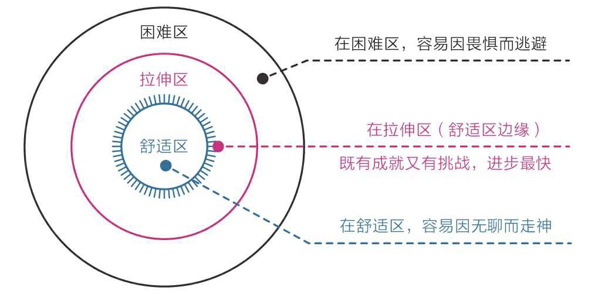
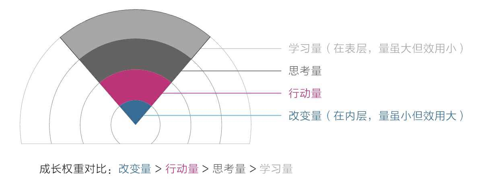
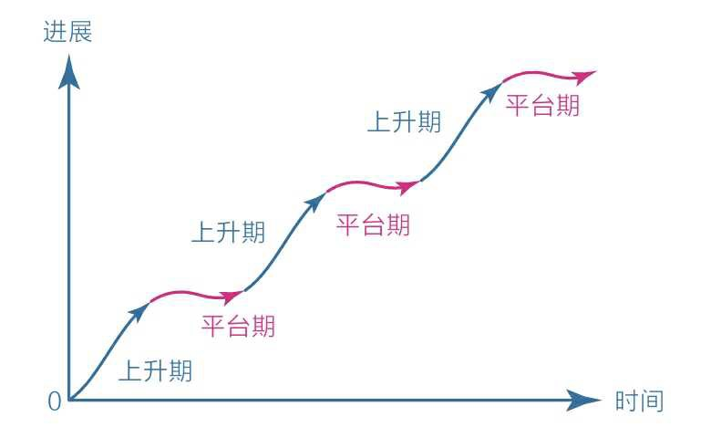

[TOC]

金庸的武侠小说，击中了人类天性中最原始、最本能的部分——及时满足。

并且故事还突出了主人公们善良的品性，似乎好运只会光顾那些心性单纯的人，让人们误以为心性单纯优于努力，要想获得成功，只要保持心性单纯就好了——保持心性单纯比保持努力容易多了。

正是这种不用付出巨大努力就能获得超强能力的快感让人心驰神往，因为现实生活中无论读书、考试，还是工作、赚钱，要想表现出色都必须经受长时间的磨练。可惜故事是故事，现实是现实，我们可以暂时沉浸在故事中，但终究要回到现实面对规则：**要想有所成就，必须保持耐心，延迟满足。**

## 那些年，我们一起误解过的耐心

很多人虽然嘴上说要保持耐心，但身体却诚实地游走在即时满足的边缘。

- 他们总是从最简单、最舒适的部分开始一天的工作，然后沉迷于娱乐信息、醉心于周边琐事，就是无力去做重要的事情；
- 他们花大量的时间寻找干货文章，点击收藏，但今后可能再也不会点开；
- 他们的新年计划非常完美，在出炉的那一瞬间，就像自己已经完成一样，但没过几天，那计划就不知所踪了；
- 他们有时也“勤奋”得出奇，疯狂提升自己的阅读量、践行“一万小时定律”，每天坚持做同一件事，但始终与成功无缘；
- 他们刚有了一点点改变，甚至在还只有一个想法的时候，就会急着向全世界宣告自己将要开始新生活了，但只要遇到一点挫折，很快就会消沉放弃；
- 他们看到自己与同龄人有很大差距时，就会变得非常焦虑，然后去报很多课、读很多书、做很多事，并期望立即看到变化。
- 总之，他们希望只读几本书就能博学多识，坚持21天就能养成一个习惯，少吃几口饭就能变瘦，读完一篇干货文章就能立即改变……

一口气罗列了这么多劣习，并不是为了给自己做铺垫以站在道德制高点上向大家说教，事实上，这些都是我踩过的坑，我也曾是“他们”中的一员，所以对此感同身受。**我深知这些品性会毁人一生，至少会让人庸碌无为，因为缺少耐心这个品质，再多的努力也会白费。**

但是从小到大，从来没有人告诉过我们耐心到底是什么、怎样才能有耐心。我们只是一次又一次地被教导：“要保持耐心！不要猴急！不要三心二意！”以至于**人们对耐心这个概念的理解普遍倾向于忍受无趣、承受痛苦、咬牙坚持、硬扛到底。总之就是用意志力去对抗——如果做不到，只能说明自己意志力不强。**

然而真相根本不是这样的。**我们对耐心的理解过于肤浅，以致大部分时间都在痛苦中挣扎**。既然耐心是如此重要的品质，我们没有理由不补上这一课。

## 缺乏耐心，是人类的天性

缺乏耐心根本不是什么可耻的事，和自己的道德品质也全无关系，这仅仅是天生属性罢了，每个人都一样。如果你觉得这些共识仍有些虚无，那不妨再观察一下身边的婴儿、孩子和成人。

**社会中的精英通常是那些能更好地克服天性的人，他们的耐心水平更高，延迟满足的能力更强。**

## 认知规律，耐心的倍增器

很多时候，我们对困难的事物缺乏耐心是因为看不到全局、不知道自己身在何处，所以总是拿着天性这把短视之尺到处衡量，**以为做成一件事很简单**。事实上，如果我们能了解一些事物发展的基本规律，改用理性这把客观之尺，则会极大地提升耐心。

### 宏观规律

**复利效应**，显示了价值积累的普遍规律：前期增长非常缓慢，但达到一个拐点后会飞速增长。

对于任何没有特殊资源的个体或群众来说，坚信并践行这个价值积累规律，早晚能有所成就。当然，前提是选择正确的方向，并在积累的过程中遵循刻意练习的原则，在舒适区边缘一点一点地扩展自己的能力范围。

人类的天性却正好与这个规律相反。**在欲望上急于求成**，总想一口吃成个胖子，导致自己终日在困难区受挫；**在行动上避难趋易**，总是停留在舒适区，导致自己在现实中总是一无所获。如果我们学会**在舒适区边缘努力**，那么收获的效果和信息就会完全不同。

复利曲线和舒适区边缘是一对好朋友，它们组合在一起可以让我们在宏观上看到保持耐心的力量，而且这种力量适用于每一个普通人。

### 微观规律

#### 1.成长权重对比

对于学习成长而言，**成长权重对比**是每个人都应该首先认识的，它揭示了“学习、思考、行动和改变”在成长过程中的关系：**对于学习而言，学习之后的思考、思考之后的行动、行动之后的改变更重要，如果不盯住内层的该变量，那么在表层投入再多的学习量也会事倍功半；因此，从权重上看，改变量 > 行动量 > 思考量 > 学习量。**

很多人之所以痛苦焦虑，就是因为只盯着表层的学习量。

- 他们读了很多书、报了很多课，天天打卡、日日坚持，**努力到感动自己**；
- 但就是没有深入关注过自己的思考、行动和改变；
- 所以总是感到学无所获，甚至会认为是自己不够努力，应该继续加大学习量，结果陷入了“越学越焦虑，越焦虑越学”的恶性循环；

原因仍然是我们的天性在作祟。

- 因为单纯保持学习输入是简单的，而思考、行动和改变则相对困难。在缺乏觉知的情况下，我们会本能地**避难趋易**，不自觉得沉浸在表层的学习量中。
- 表层学习是最能直接看到效果的，而底层的改变则不那么容易发生，所以**急于求成**的天性也会促使我们选择前者。

比如，读书时不求记住书中的全部知识，只要有一两个观点促使自己发生了切实的改变就足够了，其收获与意义比读很多书但仅停留在知道的层面要大得多。时常以这样的标准指导自己学习，我们的收获就会越来越多，焦虑就会越来越少，耐心自然也就越来越强了。

#### 2.平台期

平台期表明，学习进展和时间的关系并不是我们想象中的那种线性关系（学多少是多少），而是呈现一种波浪式上升曲线。

几乎任何学习都是这样的，刚开的时候进步很快，然后会变慢，进入一个平台期。在平台期，我们可能付出了大量的努力，但看起来毫无进步，甚至可能退步，不过这仅仅是一个假象，以为大脑中的神经元细胞依旧在发生连接并被不停地巩固，到了某一节点后，就会进入下一个快速上升阶段。

当我们清楚了这个规律后，就能**在面对长期的冷寂或挫折失败时做出与他人不同的选择：有人选择放弃，而我们继续坚持。**

**耐心不是毅力带来的结果，而是具有长远目光的结果**。这也从侧面回答了为什么我们需要终身学习。因为当我们知道的规律越多，就越能定位自己所处的阶段和位置、预估未来的结果，进而增强自己持续行动的耐心。毫无疑问，对外部世界的规律的认知能使我们耐心倍增。

## 怎样拥有耐心

知道大脑构造和事物规律这些知识，我们的耐心水平就已经在无形中提升了很多。

- 首先，**面对天性，放下心里包袱，坦然接受自己**。
  - 一旦察觉自己开始失去耐心了，就温和地对自己说：“你看，我身体里那个原始人又出来了，让他离开丛林到城市生活，确实挺不容易的，要理解他。”
  - 培养耐心，要从接受自己缺乏耐心这一事实开始。
- 其次，**面对诱惑，学会延迟满足，变对抗为沟通**。
  - 温和地告诉本能脑和情绪脑：“该有的享受一点都不会少，只是不是现在享受，而是在完成重要的事情之后。”这是一个有效的策略，因为放弃享受，它们是不会同意的，但延迟享受，它们是能接受的。
  - 这种“后娱乐”的好处是，将享乐的快感建立在完成重要任务后的成就感上，很放松、踏实，就像一种奖赏；而“先娱乐”虽然刚开始很快活，但精力会无限发散，拖延重要的工作，随着时间的流逝，人会空虚、焦虑。
  - 耐心，不能急于求成，允许自己缓慢地改变，甚至经常失败。无论结果如何，和自己对话都会产生效果。
- 最后，**面对困难，主动改变视角，赋予行动意义**。
  - 面对困难之事，可以持之以恒的人，除了知晓前面提到的各种规律，还因为他们更擅长探索原理，会主动改变认知视角，来找到行动的意义和好处：
    - 比如当我们清楚了阅读的本质和意义，就可能放下手机，主动拿起书本；
    - 当我们明白了深度学习的意义，就可能放弃听书、速读，转而开始精读和输出；
    - 当我们明白了运动真正的好处，就可能告别慵懒，主动坚持锻炼；
  - 最高级的方法，是**请本能脑和情绪脑出动来解决困难**。
    - 想办法让本能脑和情绪脑感受到困难事物的乐趣并上瘾，才是理智脑的最高级的策略。学会释放本能脑和情绪脑的强大力量，我们就会无往不胜！

