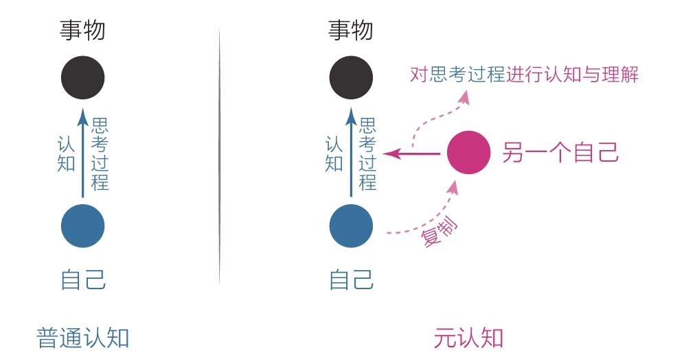
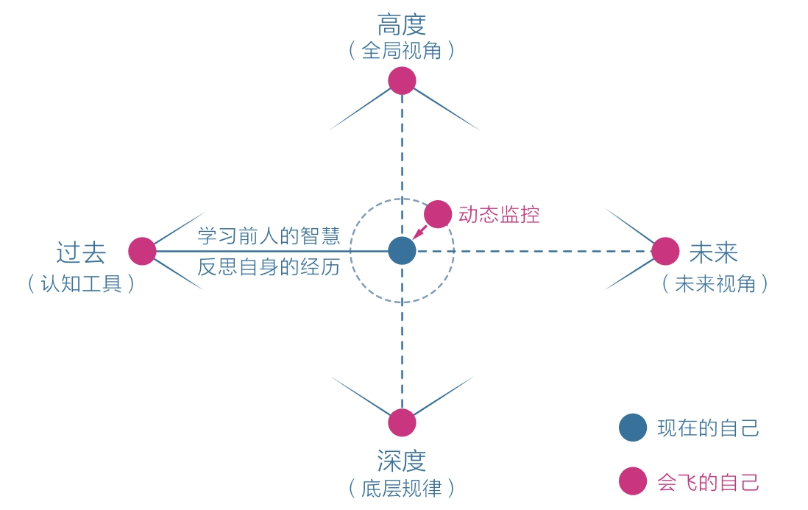

[TOC]

# 三、元认知——人类的终极能力

## 1 元认知：成长慢是因为不会飞

早在15万年之前，人类就已经拥有这种能力，当然不是指人的身体真的飞到空中，而是指意识与本体分离，“飞”到更高处去反观自己。

### 1.1 万物之灵的根源

`元认知`，就是最高级别的认知，它能对自身的“思考过程”进行认知和理解。

- 人类大脑进化出了新皮层，这使我们具备了极强的感知和思考能力，从而可以依靠理智生活，而其他动物只能依靠本能和情绪来生存。
- 更神奇的是，人类还可以观察自己的思维活动，找出其中不合理的地方，然后改进优化，不断做出更好的选择。
- 人的思维就好比一把锤子，它不但能钉钉子，还可以复制出另一把锤子来捶打自己。
- 只要方法正确，时常修订，那么这把锤子就可以进化成更高级的工具。

### 1.2 元认知能力的差异

分类：
- 被动元认知
- 主动元认知

被动使用元认知能力的人，似乎只有在迫不得已的情况下才会煽动几下翅膀。而有些人即使在没有威胁的情况下也会尝试练习煽动翅膀，让自己不断进化，彻底远离危险。

从被动到主动，这是一个转折点。当一个人能主动开启第三视角、开始持续反观自己的思维和行动时，就意味着他真正开始觉醒了，他有了快速成长的可能。

### 1.3 元认知改变我们的命运

反观，是元认知的起点。当开始反思自己的思考时，神奇的事情发生了：我能意识到自己在想什么，进而意识到这些想法是否明智，再进一步纠正那些不明智的想法，进而做出更好的选择。

元认知一旦开启，变化马上就会发生。为了体验这种变化，不妨设想自己身边有一个“灵魂伴侣”，他会时刻陪伴、指引着你，于是：
- 在你走神时，他会提醒你集中注意力，去做更重要的事；
- 在你迷茫时，他会站在人生高处，帮你看清局势和格局；
- 在你生气时，他会帮你梳理情绪，帮你找到比生气更好的选择；
- 在你无解时，他会深入底层逻辑，提示你应该抓住什么；
- 在你懈怠时，他会站在人生终点，警醒你现在应该做什么；

### 1.4 如何获取元认知能力

1. 提升元认知能力的工具，需要从“过去”端获取，包括学习前人的智慧和反思自身的经历；
   1. TODO 《超越感觉》《刻意练习》
2. 自身的经历更是一种独特的财富
3. 学习和反思是静态的，处于当下、动态的自己需要启动“灵魂伴侣”，主动运用元认知能力；
   1. 元认知能力可以让我站在高处俯瞰全局，不会让我一头扎进生活的细节，迷失其中；
4. 冥想可以提高元认知能力
   1. 监控自己的注意力，然后将其集中到自己需要关注的地方；

