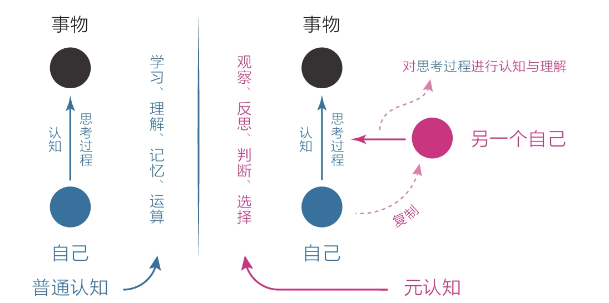

[TOC]

## 2 自控力：生而为人为了成为思维舵手

元认知能力就是觉察力和自控力的组合。

从实用角度讲，元认知能力可以被重新定义为：`自我审视、主动控制，防止被潜意识左右的能力`。

### 2.1 我们天然被潜意识左右

- 当下：起床时第一反应是拿手机
- 每天：临近下班时的灵魂拷问：这一天都做了些啥？
- 一生：人生目标是否经过了自我审视和主动控制？

### 2.2 成长就是为了主动控制

理智脑的战斗力主要表现在两方面：

1. 侧重学习、理解、记忆、运算的认知能力；
2. 侧重观察、反思、判断、选择的元认知能力；

每当遇到需要选择的情况时，要是我们能停留几秒思考一下，就有可能激活自己的理智脑，启用元认知来审视当前的思维，然后做出不一样的选择。

**一定要在选择节点多花“元时间”。**

### 2.3 成为自己人生的思维舵手

在选择节点**审视自己的第一反应**，并**产生清晰明确的主张**。

元认知能力强的表现，**对模糊零容忍**。

成为思维舵手的方法：

1. 针对当下的时间，**保持觉知**，审视第一反应，产生明确的主张；
2. 针对全天的日程，**保持清醒**，时刻明确下一步要做什么；
3. 针对长远的目标，**保持思考**，想清楚长远意义和内在动机；

元认知能力强的人就是这样：无论是当下的注意力、当天的日程安排，还是长期的人生目标，他们都力求想清楚意义、进行自我审视和主动控制，而不是随波逐流。

高尔基曾经说过：每一次克制自己，就意味着比以前更强大。
