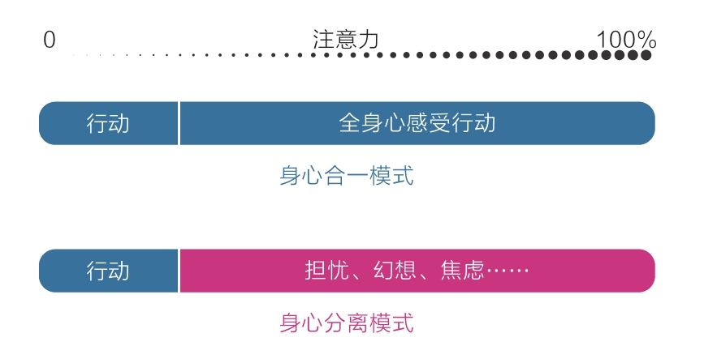

[TOC]

# 四、专注力——情绪和智慧的交叉地带

## 1 情绪专注：一招提振注意力

这种做A想B的行为模式却实实在在地影响着我们，使我们在不知不觉中徒生烦恼、渐生愚钝。从某种意义上来说，它正是我们烦恼和无能的来源。

### 1.1 行动如躯体，感受如灵魂

起初，行动和感受二者是统一的。
我们会在做一件事情时全身心地感受这件事，将注意力全部放在和当前事务相关的事情上，所以跑就是跑，吃就是吃，睡就是睡。。。我们刚开始学习某项技能，或还只是孩童的时候通常是这样的，那时的我们善于投入，敏于接受，平和无忧，灵性十足。

就身心分离模式来说，身体上的影响实属小事，真正严重的是它会对我们的情绪状态和能力提升产生持续的负面影响。

### 1.2 分心走神的原因与危害

分心走神的原因：
1. 觉得当下太无聊，追求更有意思的事情；
2. 觉得当下太痛苦，追求更加舒适的事情；

分心走神的成本太低，而人的天性又是急于求成和避难趋易的。

走神带来的最大损失，莫过于生命质量变差。

走神可以让我们活在任何时候，唯独不能让我们活在当下。

而生命是由当下的一个个片段组成的：
- 身心合一的片段组成的就是幸福专注的高质量人生；
- 身心分离的片段组成的就是分心走神的低质量人生；
- 分心走神还会造成拖延和低效，因为情绪总是滞后于行动，所以人们做事时进入状态往往很慢，需要情绪过渡。

从长远看，一个人专注力的高低，可能预示了他今后成就的大小。

成长就是克服天性的过程，我们必须用觉知力和自制力来约束天性，否则就会被潜意识左右而不自知。

### 1.3 收回感受，回归当下

如果一个人从小就养成了全情投入和界限清晰的专注习惯，那他不仅能获得智力上的聪慧，也能获得情绪上的平和。

身体感受是进入当下状态的最好媒介，而感受事物消失的过程，更是一种更好的专注力训练。

身心合一的要领，不仅是专注于当下，更是享受当下，而这种享受必将使我们更从容，不慌张。
