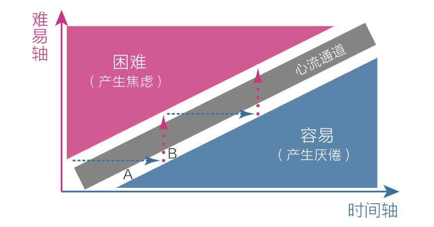
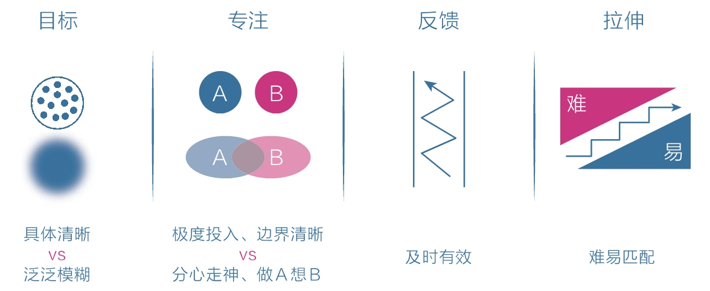

[TOC]

## 2 学习专注：深度沉浸是进化双刃剑的安全剑柄

人们因能感知太多信息而感到心神不宁，或因产生过多欲望而痛苦不堪，又或因担忧能力不足而滋生焦虑，无论顺境还是逆境都不得安生。

部分智者早已有意无意地跳出了这种限制，他们采用一种极为有效的行为模式，让自己的情绪和能力经常处于平和与高效的状态。

### 2.1 人类情绪和能力优劣的根本差异

人类情绪和能力的优劣差异来自于`对自身注意力关注方式`的差异。

能力强者则正好相反，他们的优势就在于能够主动屏蔽干扰，选择需要的信息并沉浸其中，为此他们甚至会主动练习，比如有人会故意在声音嘈杂的地方锻炼专注力，这使他拥有了随时随地进入深度阅读和思考状态的能力。

### 2.2 深度沉浸的方法

这世上能聚焦的人很多，但卓越的人很少，其原因之一就是大多数人都缺乏深度沉浸的能力。

《刻意练习》 心理学家安德斯·埃里克森和科学家罗伯特·普尔经过大量的研究后指出：`所谓天才，其实并不神秘，其本质是“正确的方法”加上“大量的练习”`。换言之，我们没有变得像天才般卓越是因为方法不对或练习不够。

正确的方法通常具有以下四个特征：
1. 有定义明确的目标
2. 练习时极度专注
   1. 专注的真正动力并不是毅力和耐心，而是不断发现技巧上的微秒差异和持续存在的关注点，精力越集中则感知越细微
   2. 两种模式好比手电筒里打出来的光：
      1. 专注模式下光束紧密，穿透能力强，径直打在一小块区域上；
      2. 发散模式下光束就会散开，虽然光的强度会降低，但照亮的范围更广；
   3. 变聪明的诀窍：先保持极度专注，想不出答案时再将注意力转换到另一件与此毫不相干的事情上。
      1. 事前聚精会神，让意识极度投入；
      2. 事后完全忘记，让意识彻底撒手；
   4. 李大钊说过：“要学就学个踏实，要玩就玩个痛快！”
3. 能获得有效的反馈
   1. 想方设法得到及时、有效的指导和反馈是不断精进的重要条件。
   2. 如果条件有限，反馈也可以通过书籍影像、与他人交流或者自我反思来获取。
4. 始终在拉伸区练习
   1. 著名心理学家米哈里·契克森米哈赖在《心流》一书中提出这样一个模型：当人们对当前的活动感到厌倦时，说明应该提高难度；当人们对当前的活动感到焦虑时，说明应该保持这个水平专注练习，如此反复交替就可以让自己进入心流通道，沉浸其中。

我们每天都要做那些让自己感到有些困难但又可以通过努力来完成的事情，即跳出舒适区，避开困难区，处在拉伸区。

从现在开始，好好地审视自己：
- 审视自己的注意力 —— 是被动吸引还是主动选择？
- 审视自己的沉浸度 —— 是分心走神还是极度专注？
- 审视自己的练习量 —— 是浅尝辄止还是大量投入？
