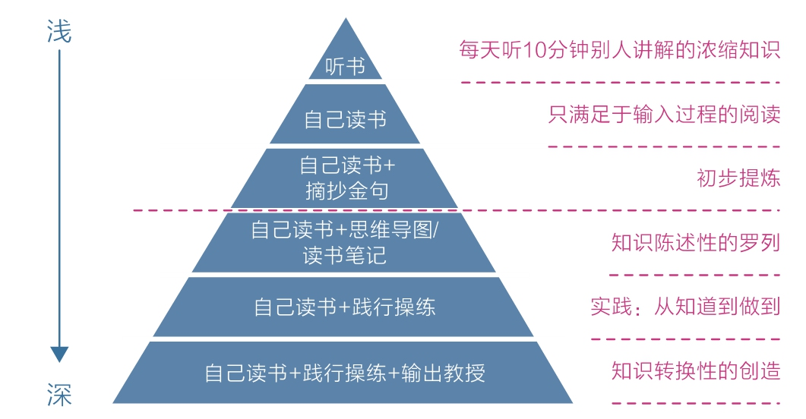

[TOC]

## 2 深度：深度学习，人生为数不多的好出路

种种迹象表明，快速、简便、轻松的方式使人们避难趋易、急于求成的天性得到了方法，理智脑的潜能受到了抑制，而深度学习的能力几乎全部依赖高级理智脑的支撑。

一小部分知识精英依旧直面核心困难，努力地进行深度钻研，生产内容；而大多数信息受众始终在享受轻度学习，消费内容。

### 2.1 何为深度学习

学习金字塔理论，学习的两个层次：
1. 被动学习
   1. 听讲、阅读、试听、演示
2. 主动学习
   1. 讨论、实践、教授给他人

当前有很多听书产品，读书达人用十几分钟解读一本书，假设我们一天听一本书，一年就能听300多本，这种便捷新颖、浓缩干货的学习方式看似轻松高效，实则处于被动学习的最浅层。

从知道到做到是一种巨大的进步，然而自己知道或做到是一回事，让别人知道或做到又是另外一回事。

“缝接”是深度学习的关键，而大多数人只完成了“获取知识”，却忽略了“缝接知识”这一步，因此，他们的学习过程是不完整的。有些人做了一定的缝接，但缝接得不够深入，没有高质量的产出，也使学习深度大打折扣。

**逼迫自己获取高质量的知识以及深度缝接新知识，再用自己的语言或文字教授他人，是为深度学习之道。**

### 2.2 如何深度学习

深度学习有如下3个步骤：
1. 获取高质量知识；
2. 深度缝接新知识；
3. 输出成果去教授；

这样的学习必然要放弃快学、多学带来的安全感，要耗费更多的时间，面临更难的处境，甚至还会“备受煎熬”。但请一定相信：**正确的行动是反人性的**，让你觉得舒服和容易的事往往得不到好结果，而一开始你认为难受和困难的事才能让你产生收获，所以我们可以通过以下几个方法逐步改进：
1. 尽可能获取并亲自钻研一手知识；
2. 尽可能用自己的话把所学的知识写出来；
   1. **当一个你精心打磨的产品打动了别人，它产生的影响力，将远比每天都写但缺乏深度的思考要大得多。**
3. 反思生活；
   1. 学习不止读书，生活经历同样可以被深度学习；
   2. 人与人的差距不是来自年龄，甚至不是来自经验，而是来自**经验总结、反思和升华的能力**；
   3. 每日写复盘反思，持续进行。

### 2.3 深度学习的好处

**深度学习除了能让我们不再浮躁，能磨练理智，还能带来诸多好处，比如跨界能力的提升。**

古典在《你的生命有什么可能》一书中提到，人的能力分为知识、技能和才干三个层次：
1. 知识是最不具备迁移能力的，你成为医学博士，也照样有可能不会做麻婆豆腐；
2. 技能通常由70%的通用技能和30%的专业技能组成，迁移性要好一些；
3. 而到了才干层面，职业之间的界限就完全被打破了；

**深度学习还能让人产生更多灵感。**

**深度学习还能让我们看到不同事物之间更多的关联，产生洞见。**

娱乐热点并非没有价值，浅层知识也同样具有意义，但前提是你需要具备一定的认知深度——**深度之下的广度才是有效的**。

### 2.4 为浅学习正名

**专注于深度学习，同时对浅学习保持开放。**

选择一些值得关注的人，和他们保持联结。他们释放的一些有价值的信息会引领我们走向更广阔的世界，但无论如何，最终要自己去读、自己去想、自己去做。
