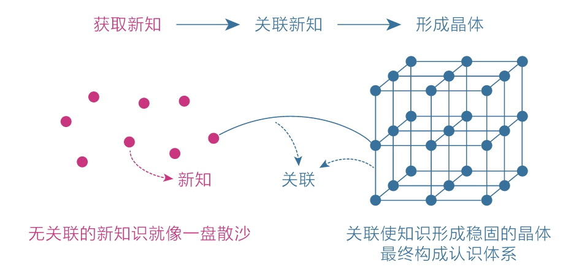

[TOC]

## 3 关联：高手的“暗箱”

### 3.1 无关联，不学习

《这样读书就够了》提出了读书的三个步骤：
1. 用自己的语言重述信息，即找到触动自己的信息点；
2. 描述自己的相关经验，即关联生活中的其他知识；
3. 我的应用，即转换为行动，让自己切实改变；

有效阅读、深度学习的三个层次：
1. 知道信息点
2. 关联信息点
3. 行动和改变

孤立的知识就像沙粒，只有关联才能将其聚沙成塔，形成稳固的知识晶体，最终构建自己的认知体系。

无论是学习动作，还是背记公式，从本质上来说都是大脑中神经细胞建立连接的过程。用神经科学术语解释就是：通过大量的重复动作，大脑中两个或多个原本并不关联的神经元经过反复刺激产生了强关联。如果没有关联这个过程，就算有再多脑细胞，你也不会变得更聪明。

鉴于此，我时常也鼓励人们写作。因为单纯阅读时，人容易满足于获取新知识，而一旦开始写作，就必须逼迫自己把所学的知识关联起来，所以写作就是一条深度学习的自然途径。

按照关联意识的强弱，人被分成了两个群体：
1. 绝大多数人习惯以孤立的思维看待事物，喜欢花大量时间收集和占有信息；
2. 而另一批先行者，则更喜欢拨弄信息之间的关联，从而在不知不觉间变得聪明了起来。

### 3.2 事不关己，不关联

普通人觉得要是不把书读完，实在是对不起作者或是自己花出去的钱，但经济学家考文却觉得他这样做很划算。**因为只有真正和自己有关的内容才对自己有用，在这个注意力非常匮乏的时代，没有必要把所有的书或是书中所有的内容都读完。**

知识的获取不在于多少，而在于是否与自己有关联，以及这种关联有多充分。

**当然，还有一个更重要的隐蔽条件不能忽视：你需要明确的目标或强烈的需求。**

### 3.3 如何获取关联能力

1. 首先，手中有锤子；
2. 其次，输入足够多；
   1. 多走走、多看看、多阅读、多反思；
   2. 人生没有白走的路，每一步都算数；
3. 再次，保持好奇心；
   1. 成长这件事，不仅仅是提高认知，更是一种自我修炼；
4. 最后，常说一句话；
   1. 但凡收获一个感悟、了解一个观点或是学到一个知识，只要触动了自己，就要想办法让它效率最大化，而效率最大化的办法就是主动关联到别处，并让自己的行动发生改变。所以你不放也把这句话当做口头禅，时常问自己：**这个道理还能用在什么地方？**

### 3.4 一切在于主动

从今日起，重新认识“关联”，主动运用它、传递它，让它不再隐藏、不再模糊。我相信肯定有人因为主动使用了它而变得与众不同。
