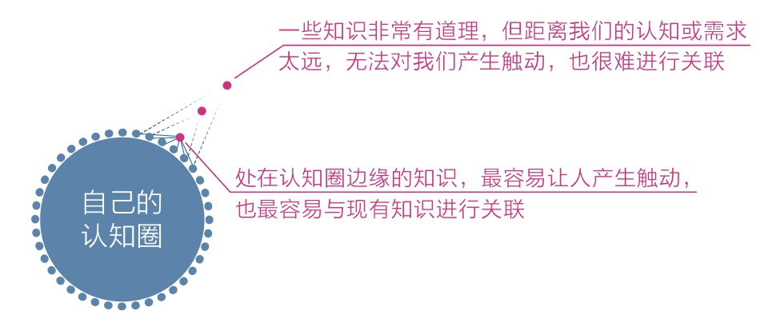
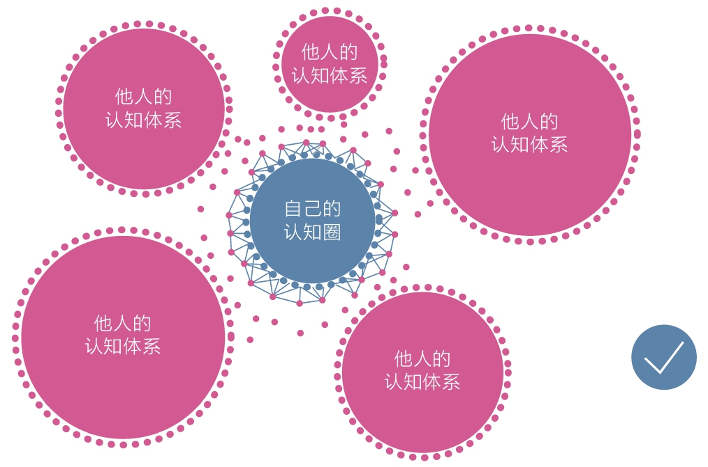
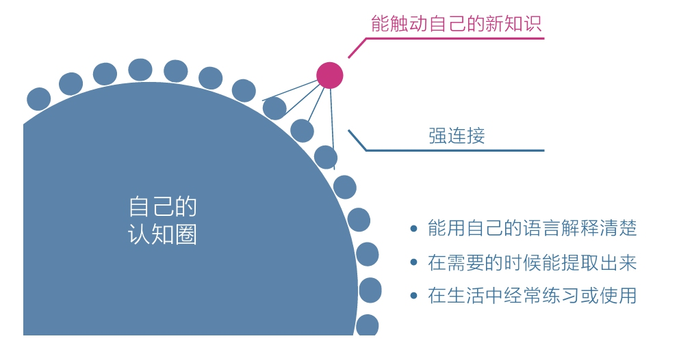

[TOC]

## 4 体系：建立个人认知体系其实很简单

如何判定一个人是否厉害？
- 要是一个人拥有的知识体系可以解决自己遇到的各种问题，那他必定是个厉害的人。

### 4.1 知识与认知的区别

知识和认知的区别
- 考试得了高分，不叫有知识；茶余饭后能高谈阔论，这也不叫有知识。
- 这些场合下，知识虽然有用，但是这些知识都不太牵扯到具体的得失，所以只是智力游戏。
- 只有当局势不明朗、没有人告诉你该怎么办，而错误的判断又会导致一些不良的后果时，你要是能因为有知识而敢于拿一个主意，这才算是真有知识。
- 请注意，这不是在说，实用的知识才是知识，而是在说，**只有当知识能够帮助你做实际决策的时候，它才是你的知识**。

个人成长的目的，已经不是“知道和理解”了，而是“判断与选择”。

在个人成长领域，没有最优、最确定、最权威的认知体系，只有最适合我们当前状态的认知体系。

### 4.2 只学让自己触动的

读书方法：
- 在阅读时，唯一要做的事情就是：**寻找触动点**。
- 在触动自己的地方做标记，在空白处写下大量能联想到的思考，书读完之后，放上几天，然后问自己：“这本书最触动自己的是哪个点？”
- 这个点可以是一个理论、一个案例，甚至是一句话，只要它真正触动我，并能让我发生真实的改变，我就认为这本书超值了。
- 至于其他，忘记就忘记了，我一点也不觉得可惜。而作者的知识体系和框架，又与我何干呢？

体系的本质，就是用独特的视角将一些零散的、独立的知识、概念或观点整合为应对这个世界的方法和技巧。

搭建个人知识体系的真相：打碎各家的认知体系，只取其中最触动自己的点或块，然后将其拼接成自己的认知网络。

### 4.3 触动是最好的筛选器

建议每一个想成长的人都去进行**每日反思**，因为它可以**提高自己对生活细节的感知能力**，不会让日子像流水一样哗哗流过而什么都没留下。
- 不过，和一般的日志不同，每日反思不是记流水账，而是**留意每天最触动自己的那件事**，不管是好的启发还是坏的体验，都写下来复盘，写得越细越好。
- 一个触动点若是能转换成一个认知晶体，我们的生命质量和密度将远远超过那些不反思的人。
- 面对生活中信息的滚滚洪流，触动真是最好的筛选器，它能让我们免受洪流的冲击，从容而体面地行走在人间。

### 4.4 仅仅触动还不够

为了让触动可以被及时强化，想办法和触动发生关系，产生连接：
1. 用自己的语言重新解释新知识，这会促使自己原有的知识体系对新知识做出反应；
2. 在需要的时候能够顺利提取知识，提取不出来的知识就是伪触动；
3. 在生活中能够经常练习或使用这些知识，因为实践才是产生强关联的终极方法；

所谓的学习成长，诸如阅读、写作、反思、培养习惯、练习技能、建立认知体系，等等，本质上都是一回事：**在舒适区边缘，一点一点向外扩展**。
