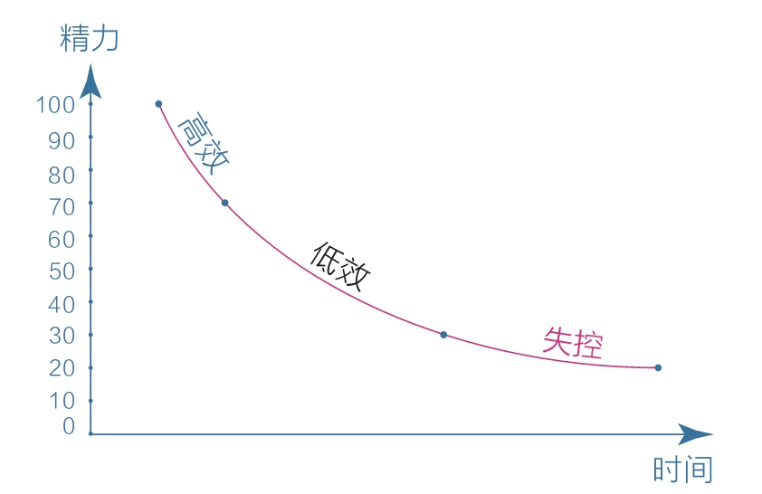
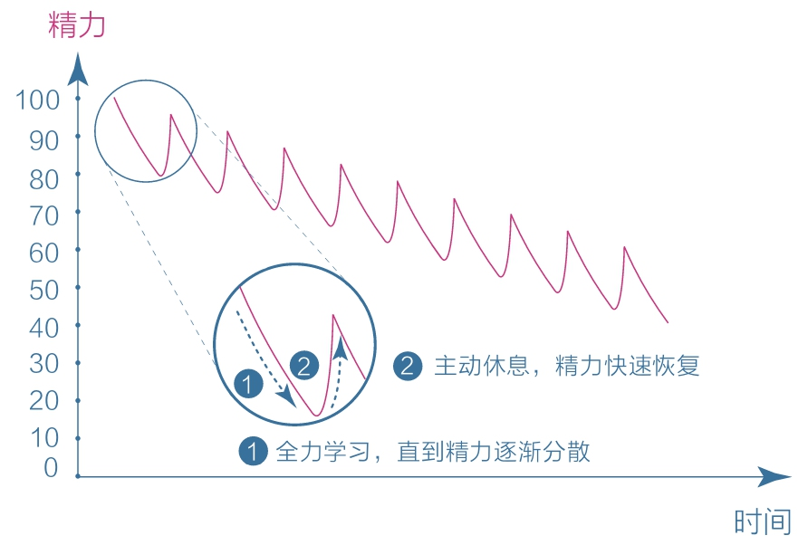
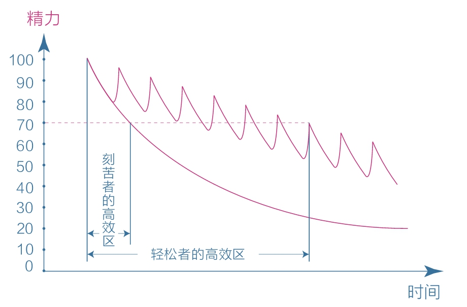
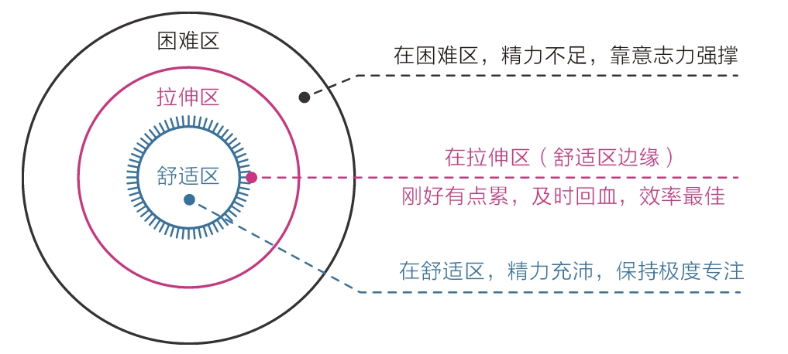
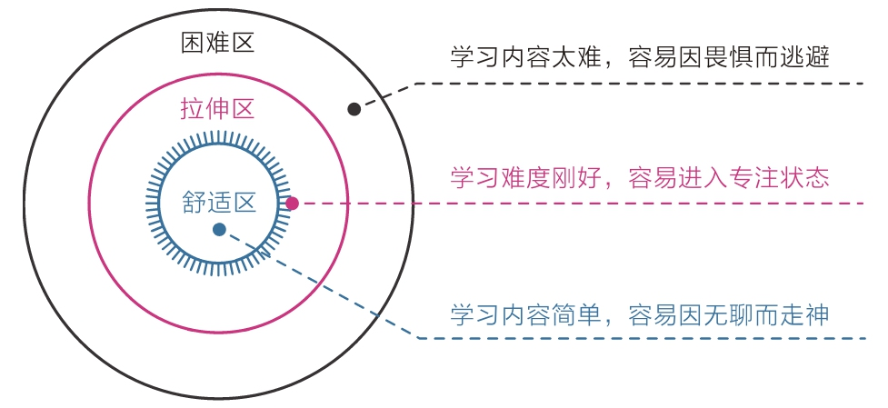

[TOC]

## 7 休息：你没成功，可能是因为太刻苦了

### 7.1 主动休息的秘密

刻意练习四要素：
- 定义明确的目标
- 极度的专注
- 有效的反馈
- 在拉伸区练习

有效学习的关键，在于保持极度专注，而非一味比拼毅力和耐心。

刻苦者，看似无比勤奋，可效果越来越差，过程中感受到的多是痛苦而不是乐趣，精力消耗严重，以致一旦放松就完全不像再次投入，他们更容易沉溺于舒适的娱乐活动。

反观那些轻松的学霸，他们学习时从不过度消耗自己，只要感到精力不足，就停下来主动休息，这反而使他们精力桶的水位得到快速回升。他们的精力曲线呈波浪状，这种循环能使精力水平一直保持在高位。

### 7.2 保持专注的危机

保持极度专注已然成了一种稀缺能力。

更科学的模式应该是：**极度专注 + 主动休息**，如此往复。

这种策略也极其符合在拉伸区练习的原则，因为一个人刚好感到有些累时，说明他正好处在精力舒适区边缘，此时主动休息、及时回血，就能使精力的使用效率最大化。那些靠意志力强撑又不够专注的人，其实已经将自己置身于精力的困难区，所以他们体验到的多是痛苦而非愉悦。

控制学习和工作内容的难度，也是保证专注的重要方式；
- 因为太容易的东西会让人因无聊而走神；
- 太困难的内容会让人因畏惧而逃避；
- 所以选择做那些“跳一跳就能够得着”的学习或工作，是最容易进入专注状态的；

### 7.3 意志失控的根源

克服困难和抵制诱惑都需要消耗意志力。

一个真正的自控高手，不是一个只知道冲刺的人，而是一个善于主动休息、保持平衡的人。

### 7.4 能拯救你的“番茄”

1992年意大利人弗朗西斯科·西里洛创立的番茄工作法，核心：先极其专注地工作25分钟，然后休息5分钟，如此循环往复。类似于高强度间歇性训练。

刻苦，是一种宏观态度；轻松，是一种微观智慧。
