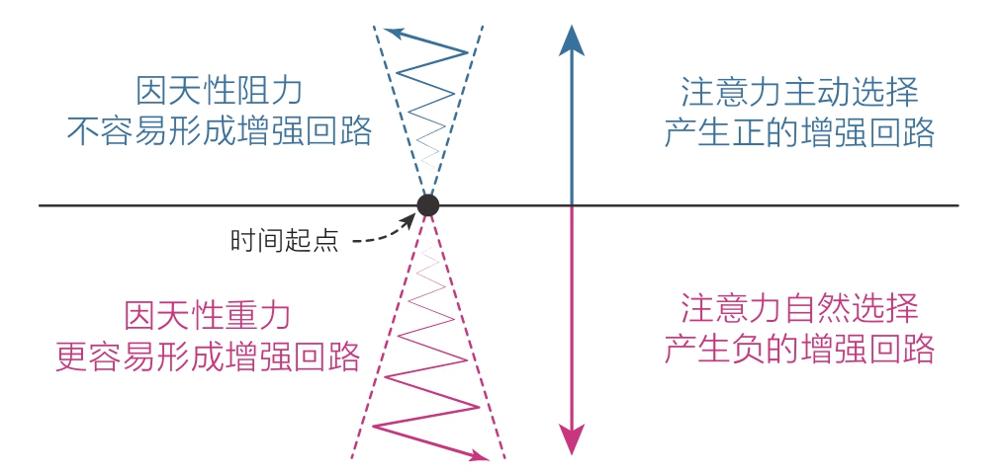
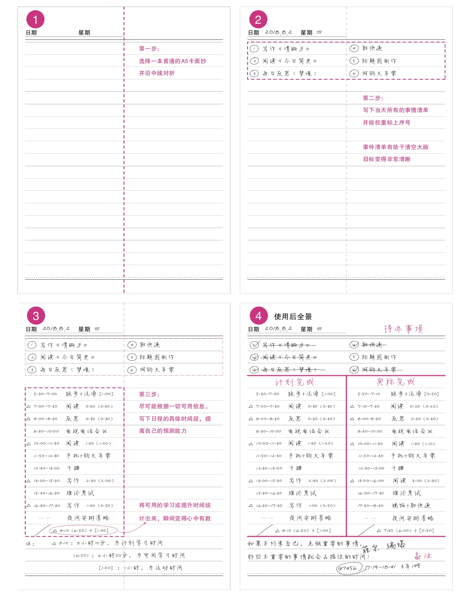

[TOC]

# 六、行动力 —— 没有行动世界只是个概念

## 1 清晰：一个观念，重构你的行动力

尤其是在完全自主的时间里，我发现自己几乎什么也做不了 —— 明知道有更重要的事要做，但脑子里总有个声音在告诉自己先去找点乐子。整个人浑浑噩噩的，就像一条无人掌舵的小船在生活的洪流里随波逐流，根本无力掌控方向。

与天性对抗是没有出路的，自制力强并不代表行动力强。

### 1.1 珍惜每天的礼物

或许你并没有意识到，每天早上醒来，我们都会受到一份礼物 —— 纯净的注意力。不管你昨天经历了什么，经过一晚的睡眠，你的精力总会得以“重启”。

注意力的增强回路是正向的还是负向的，很大程度上取决于你最初的选择，这也是老生常谈的道理：要事第一！

在初始阶段，强迫自己先做重要的事情，一旦进入正向的增强回路，你便能拥有强大的行动力 —— 这正是增强自制力、提升行动力的秘密。

### 1.2 清晰力才是行动力

知道和做到相差十万八千里，这其中的差距到底在哪里呢？答案正是”**模糊**“。

一切只知道个大概，这对提升行动力来说，是很致命的。

**清晰力，也就是把目标细化、具体化的能力 —— 行动力只有在清晰力的支撑下才能得到重构**。

### 1.3 一招建立清晰力

清晰力的建立并不复杂，做到这三个字就可以实现：**写下来**。
1. 找一本普通的A5 卡面抄，将纸页对折；
2. 在上方写下当天所有要做的事，然后清空大脑，按权重将列出的事项标上序号，这样，目标就变得清晰可见；
3. 收集一切可用信息，在页面左侧预测性地写下在某一时间段内做什么，然后在底部统计”计划学习时间“和”可用学习时间“，这样，时间也变得清晰了；
4. 在页面右侧记录当天的实施情况，一天过后，对学习时间和学习成果进行统计，时间利用效率便一目了然。

整个页面分为以下4个部分，呈现”工“字形：
1. 待办事项
2. 计划完成
3. 实际完成
4. 备注

这一方法几乎包含了时间管理手账的主要高频功能，而且这种手账可以随意写画，比如备注区可以随时记录灵感或信息，用完即弃，不用花精力在手账的形式上，时间和经济成本都非常低廉。

我曾把这个方法告诉过很多人，但大多数人并不愿意真正去做：
- 一来他们觉得这种方法太老土；
- 二来他们认为这点事用脑袋想想就可以了，写出来完全多此一举；

而现实往往是：不行动，就体会不到这种方法的好处，体会不到好处自然也就觉得这种方法没什么用。所以，只有真正做过的人才能体会到**写与不写，完全不同**。很多时候，**人与人之间真正的差距可能就体现在最后那一点点行动上**。

”写下来“就是有这样神奇的效果，因为”写下来“会清空我们的工作记忆。当我们把头脑中所有的想法和念头全部倒出来后，脑子就会瞬间变得清晰，同时，所有的想法都变得清晰且确定，这样一来，我们就进入了一种”没得选“的状态，在过程中不需要花脑力去思考或做选择。

行动力最怕模糊，如果我们头脑中一直有很多模糊选项的存在，我们就需要花心力不断地做选择，而**做选择是件非常耗脑力的事情**。我们的大脑有可能为了省点力气，而不自觉地选择那个它最熟悉、最确定的选项 —— 做那些轻松、愉快但不重要的事情。

**做规划的目的，并不是让自己严格按计划执行，而只是为了让自己心中有数**。

### 1.3 成长是个系统工程

从某种程度上说，有自己热爱的事，比行动力本身要重要得多，因为一旦有了热情，你就会自带“要事第一”和“提高清晰力”等各种属性。所以除了清晰力，我们还需要拥有寻找目标的感知力、掌控自由的匹配力、指导万物的元认知能力，等等，把它们联系起来，才能从内心深处真正地提升自己。

### 1.4 一切源于“想清楚”

你陷入怠惰、懒散、空虚的情绪中动弹不得时，往往是因为你的大脑处于模糊状态。
- 大脑要门不清楚自己想要什么；
- 要么同时想做的事太多，无法确定最想实现的目标是什么；
- 要么知道目标，但没想好具体要在什么时候以什么方式去实现；

不管你处在什么状态下，只要拿出笔和纸，写下目标，写下时间，你的元认知能力就能迅速提升，你就会动力满满。归结起来还是那句话：**认知越清晰，行动越坚定**。

聪明的思考者都知道“想清楚”才是一切的关键，在“想清楚”这件事上，他们比任何人都愿意花时间，而普通人似乎正好相反，喜欢一头扎进生活的细节洪流中，随波逐流，因为这样似乎毫不费力。于是在普通人眼里是“知易行难”，而在聪明人眼里是“知难行易”，这一点值得我们反思。
