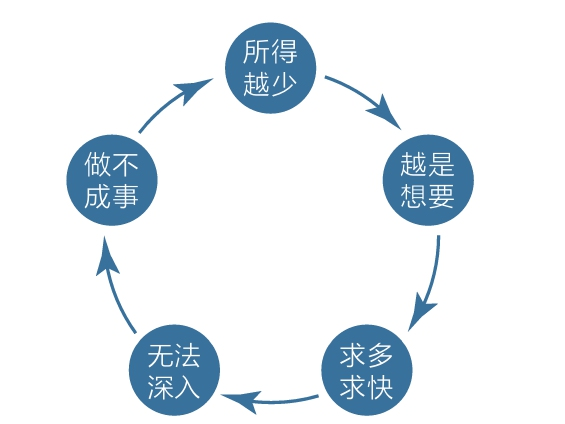
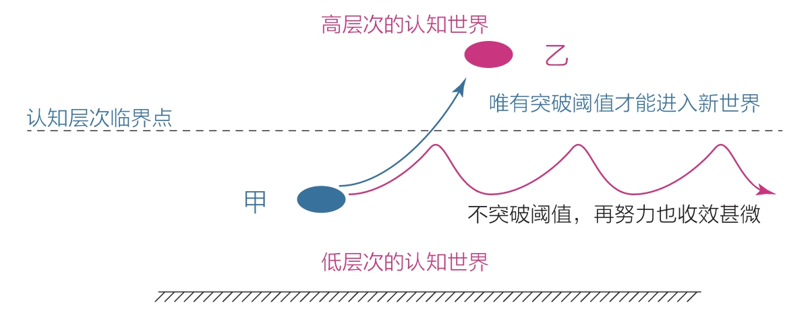

[TOC]

## 2 傻瓜：这个世界会奖励那些不计得失的傻瓜

我敢打赌，凡是买了一堆书没读、报了一堆课没上、心中有无数欲望的人，几乎没有主动做成果一件事，比如养成早期、跑步、阅读的习惯，练就写作、画画的技能，考个好成绩，开个好公司，有高收入，等等。这个判断是我基于很多人的经历做出的。

错误示范：心里始终萦绕着两个年头：
- 一是凡事必须在看到明确的结果后才行动，如果前景不确定、不明朗，即使别人说得再有道理，我也不愿意投入；
- 二是如果一个道理或方法不能让自己快速发生变化，就不是最优的，所以要不断寻找，这样才有希望找到最好的方法。

### 2.1 成长中的悖论

一次是傻傻地敲键盘，一次是傻傻地写文章，我看到了创造文字的好处，进而主动做成了这件事。而以前的我爱耍一点小聪明，总希望能先看到结果再行动，反而浪费了很多时间。（古典在超级个体专栏里讲了一个小故事，他们一行人去爬山，很多人在争论怎么走，而他直接开始行动，也是类似的智慧吧。）

想先看到结果再行动的人往往无法看到结果。
- 耍小聪明的人会因为结果不明朗，担心付出没有回报，所以不愿行动，以致永远停留在原地；
- 事实上，只要道理正确，就别在乎那些小聪明，带着不计得失的心态向前走，你会发现目标越来越清晰；

人们无法证明一件没有发生过的事。

当我们绞尽脑汁去想却仍然想不清楚的时候，就要依据前人的假设先行动起来，只有这样，我们才能更接近目标的本质，才能想得更清楚。

思考很重要，但光想不做，贻害无穷。事实上，你只要做上一次就会发现：做成一件事真得很不容易。

凡事看结果。当你从现实结果中得到成长的真相时，什么“学习焦虑”、“三分钟热度”、“知而不行”就都不算事了。你会主动斩断幻想、专注一点、精心行动，因为除此之外，别无他法。

不要垂涎别人二十几岁身家百万，不要羡慕别人一夜成名，他们的故事若无法真实地改变你，那对你而言都是幻想。还不如踏踏实实地用行动让自己一点一点变好，毕竟，现实结果才是最好的“评判师”。

### 2.2 突破阈值

付出的努力必须达到某种程度才能影响一个体系，而努力程度低于这个阈值时，行动就会收效甚微。

比如我开始早期和跑步的时候，起初是有一些痛苦的，但扛过去之后，我就体会到了早期和跑步给自己身心带来的不可思议的体验。回头想，最难坚持的时候可能就是突破阈值的时候，幸好自己当时没有放弃。从那以后，要是哪天没有早期跑步，我反而会觉得难受。我知道，当自己停不下来的时候，表示已经突破了阈值，上升到了一个新的层次。

### 2.3 做一个有理有据的“傻瓜”

行动力强，是因为自己赞同行动背后的原理、依据和意义，而不是别人说做这个好，自己不深入了解就跟风去做，那才是真的傻。
- 如果你觉得别人讲的道理有理有据，而自己暂时无法反驳，碰巧自己又非常想做这件事，那就相信他们说的是对的，然后笃定地行动。

同样的道理摆在面前，有的人觉得那是鸡汤，没什么用，而有的人却觉得那是干货，好用得不得了。如果你能持续行动，我相信，这个世界一定会特别疼爱你。
