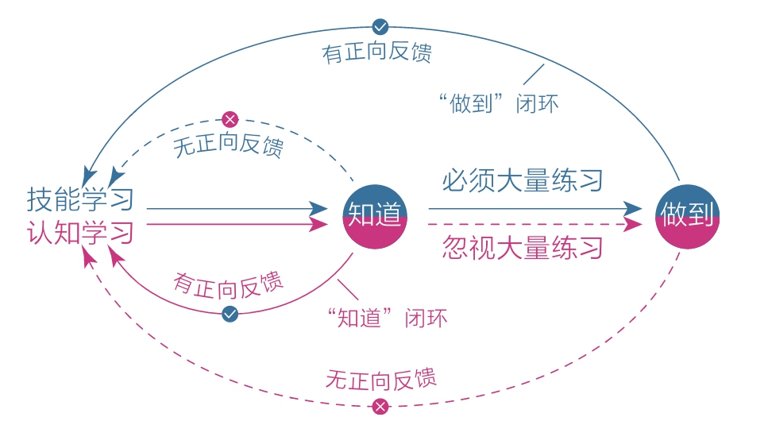

[TOC]

## 3 “道理都懂，就是不做”怎么破解

有太多人想不通为什么自己“懂得那么多道理，却依然过不好一生“。这种困惑来得如此自然，每个人在成长路上都会不可避免地遇到。
- 有些人走出来了，有的人却始终困在里面。
- 走出来的人看得透亮，而困在里面的人百思不得其解：
  - 为什么付出再多的心血也无法达成一次持续的行动？
  - 在他们心里，始终有这样一种执念：自己现在不做是因为还没有找到最好的方法，等找到那个方法以后，一切就会变得不一样。于是他们在寻找、搜集道理的路上越走越远。
  - 他们阅读了很多有道理的书，收藏了很多有道理的文章，觉得自己无所不知，却始终不能俯下身子去行动。因为他们总认为自己还没准备好，担心方法不是最优的，贸然行动会走弯路等，殊不知，这样的观望、等待本身就无效率可言。更使人困扰的是，道理知道得越多，行动力反而越弱，因为似乎总有更好的道理等着我们去发现。
- 很多人因为缺乏耐心、急于求成，总想跳过行动环节，寻求捷径，最后发现：这才是走了弯路，真正的捷径正是那条看起来漫长且低效的行动之路！

### 3.1 认知，其实是一种技能

在科学家看来，学习任何一门技能，本质上都是大脑中的神经细胞在建立连接。
- 用科学术语解释：通过大量的重复动作，大脑中两个或多个原本并不关联的神经元受到反复刺激之后产生了强关联。

当我们还不会骑自行车的时候，看别人骑，会觉得那并不难 —— 只要手把方向，双脚交替踩踏就可以了。然而真到了自己骑的时候就不是那么回事了 —— 重心左摇右晃，方向左摇右摆，速度快不了，害怕会摔倒，紧张得厉害……

这是因为我们还没有足够过的联系，大脑中相关的神经元也没有受到足够多的刺激并产生强关联，所以，即使我们能轻松理解骑自行车是怎么回事，但这项技能自己实际并未掌握。直到我们学会这一技能，再经过无数次的日常运用，大脑中相关的神经元连接才会变得异常牢固，我们才会真正掌握骑车这项技能。

觉醒就意味着看清，意味着主动改变默认设置，并做出新的选择。从现在开始，把认知当成技能，知道或想通一个道理时，不要高兴得太早，想想后面还要做大量的练习，这样就不浮躁了。

### 3.2 一开始做不好很正常

很多人认为自己必须有绝对优势或极大的兴趣和天赋才愿意行动，否则就直接放弃。就像小孩子在玩游戏时必须保证自己能赢才愿意玩，否则就不玩了。可是我们已经不是孩子了，我们应该学会用更成熟的心态包容自己最初的笨拙，即使做不好，也要持续练习，给神经元留够关联时间。

《思维导图》作者形象地描述养成习惯时大脑的工作情况：
- 当你每次产生一个想法时，带有这个想法的神经通路中的生化电磁阻力就会减少一些，就像在丛林里清出一条小路一样。
- 一开始非常费劲，但是随着你经过这条路次数的增加，这条路也会开辟得越来越彻底，你所遇到的阻力也会慢慢变小。
- 到最后，这条小路会变得平坦而宽阔。

### 3.3 我们能做的其实很少

人们不愿意行动的另一个原因：**欲望太多**。

打破执念最好的办法就是着眼于现实改变。

**不发生真正改变的学习都是无效的学习**。

当”改变“成了读书学习的最高标尺后，我们的学习量还有可能下降。

现实和理论都告诉我们：懂得百点不如改变一点。真正的成长不在于自己懂了多少道理，而在于自己改变了多少。

对成长来讲，**道理都是”空头支票“，改变才是”真金白银“**。当你凡事都以改变为标准时，你的成长路径会更加清晰。
