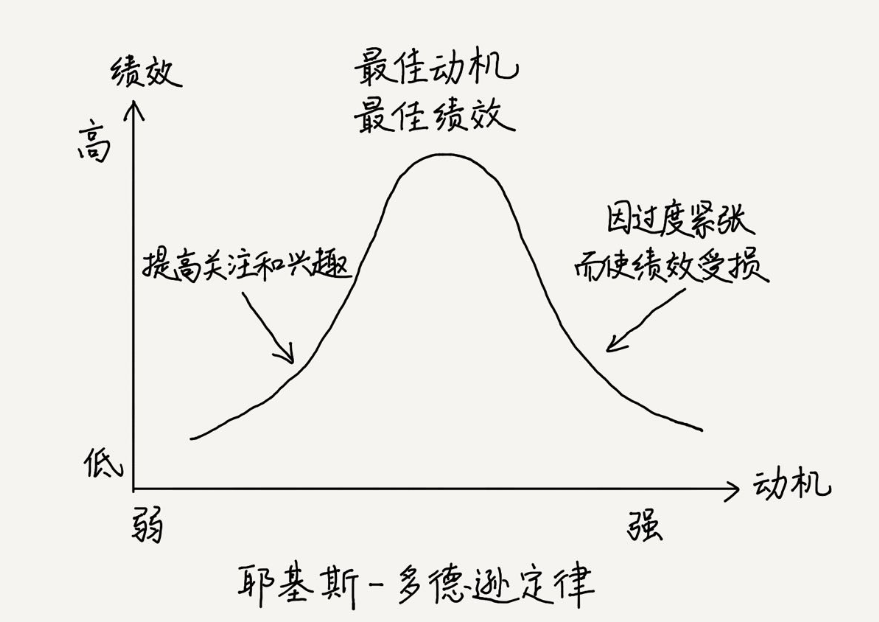

[TOC]

## 为什么面试会紧张？

### 客观角度

从生物学角度来看，紧张是我们作为哺乳动物几百万年进化而来的一种本能。

杏仁体，让人保持活跃，是人类早期预警系统的一部分。不断扫描危险事物，一旦判断为不利情况，就会向身体发出警告。

恰巧，面试中陌生的环境、陌生的面试官、陌生的问题、挑战性的气氛、一时的语塞，或者不理想的回答，都会被认为是不利的信号。处于“杏仁体劫持”状态，停止了思考器官。

面试其实和相亲差不多，看似权利在面试官，其实是双向选择。不只有面试官挑选候选人，候选人也在挑选公司。

近些年，企业越来越不容易招到合适的人才
1. 互联网和 IT 行业的快速发展，招聘职位显著增加
2. 用户对软件服务的质量和响应速度提高了要求，导致技术更加复杂，管理更加精益，对人才的技能和心智都提高了要求
3. 人力成本的增加

面试是双向选择，虽然这种选择权利的不对等暂时存在，但是会马上反转。

还有一点，面试官也紧张，尤其是一个年轻面试官要面一个资深大牛时，或者旁边坐着面试官的老板。

### 主观角度

主观角度来看，求职者面试的紧张程度与其对职位的期待程度成正比，与其对自身的自信程度成反比。

$$
面试的紧张程度 = {\frac {期待}{自信}}={\frac {期待}{能力+准备}}
$$

## 缓解紧张方法

### 1. 调整期待

调整期待，特指调整对结果的期待。

耶基斯 - 多德逊定律（心理学定律），人们从事某一件事的动机强度并不和做事的绩效成正比，而是呈倒 U 形的关系。

- 动机处于适宜强度时，做事绩效最佳
- 动机强度过低时，会缺乏积极性，绩效不可能提高
- 动机强度超过顶峰时，因为过强的动机会使机体处于过度焦虑和紧张的心理状态，干扰记忆、思维等心理过程的正常活动。

  

适当调整自己的期待，把动机从“一定要通过面试”转变成“这次面试会带给我经验积累和能力提高”，心态就会平和很多。

正确看待面试：

1. 世界那么大，人生那么长，机会那么多，一场面试不能定终身。从失败中总结教训，了解面试过程和问题。
2. 把面试看做沟通和了解公司的过程。
3. 调整自己的期待，找适合自己难度的工作，有利于小步提高。

### 2. 提高能力

1. 通过面试的能力
    - 准确理解面试官的问题，把自己真实能力展现给面试官
    - 同时通过观察和总结面试过程，了解公司和团队，达成双向选择
2. 职位要求的能力，即完成工作所需要的的能力
    - 硬技能
        - 专业能力
            - 程序员：代码写得效率更高、实现得更优雅，多研究新技术
            - 产品经理：多学习市场调研、需求分析、产品策划的技能
    - 软技能
        - 表达沟通
        - 协作管理

### 3. 充分准备 

- 减少面试主题和问答的不确定性
    - 需要了解本次面试的目的、面试官角色和风格、职位的职责和能力素质要求
- 减少环境影响的不确定性
    - 提早到面试公司，在允许参观的场所内，熟悉一下环境
- 自己状态保持最佳
    - 精神状态
        - 面试前保证好休息，不要熬夜
        - 注意早上和下午的思维活跃度也会有所不同
        - 回忆一个自己过去的荣耀时刻，想象当时的自豪感，以及人们的赞扬和敬仰，提升自信，增强正面情绪
    - 心理状态
        - 想2个面试官记住自己的精华点：反应自己优势和扭转劣势的经历
        - 准备好2个版本的自我介绍，一个3分钟，一个1分钟，提前练熟

## 面试小技巧

- 提前喝一点点甜的饮料，提升内心愉悦感，激发思维活跃度
- 体会面试官和周围环境的友好之处
- 不说假话，人在说假话时自信心会下降
- 专注在问题本身，而不过多揣测面试官评价
- 听完问题，停顿两三秒，思考下对方意图，梳理表达思路，再作答
- 如果声音颤抖或忘词，可以向面试官坦白，对不起，有些紧张，更能赢得面试官的理解和耐心

**时刻谨记，你的目的是向面试官尽可能真实地展示你的工作和思考，把他看重的那部分给出足够的细节，赢得认可。适度的紧张，反而有利于你保持思维活跃。**
